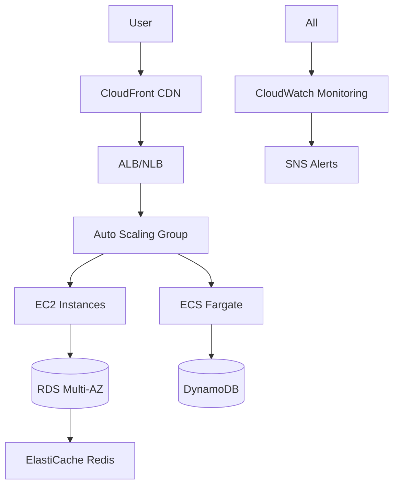

# Loftwah's DevOps Refresher and Interview Study Guide

This repository is a comprehensive resource for mastering DevOps concepts, preparing for technical interviews, and building hands-on skills with AWS, coding, system design, and more. It’s designed for engineers looking to refresh core DevOps knowledge or ace interviews with practical, real-world applications.

Architecture Decisions

- `docs/decisions/ADR-000-environments.md` — single staging environment defaults
- `docs/decisions/ADR-001-alb-tls-termination.md` — TLS at ALB, redirects, DNS/ACM
- `docs/decisions/ADR-002-secrets-and-config.md` — secrets vs. config strategy
- `docs/decisions/ADR-003-security-groups.md` — SG structure and rationale

## Repo Conventions

- Kubernetes assets live under `kubernetes/`:
- `aws-labs/kubernetes/helm/` for Helm values and helpers
- `aws-labs/kubernetes/manifests/` for raw manifests
  - `kubernetes/policies/` for IAM policies used by controllers
- YAML extension: use `.yml` across the repo for consistency, except where upstream tools require specific names:
  - Helm chart files must be `Chart.yaml` and commonly `values.yaml` as the default values file.
  - Other YAML files (templates, manifests, values you pass with `-f`) may use `.yml`.

## 1. Coding (LeetCode / Interview Prep)

### How to Work

- For each problem solved:
  - Code solutions in **Ruby, Go, Python, and TypeScript** (to compare paradigms: Ruby for elegance, Go for concurrency, Python for simplicity, TypeScript for modern web development).
  - Add **time and space complexity analysis** (Big O notation, with explanations of bottlenecks).
  - Write a short "pattern takeaway" + **real-world application** (e.g., how it applies to DevOps tools like caching in Kubernetes or load balancing algorithms).
  - Store in `leetcode/<category>/<problem>.md` with code snippets, test cases, and edge cases.
  - Track progress in a Git repo with branches per category. Use tools like LeetCode CLI or VS Code's LeetCode extension for automation. Aim for 5-10 problems/week, reviewing patterns weekly.
  - **Deliverables per Problem:** Solution code, complexity, takeaway, application example, 3-5 test cases (including failures), and optimizations.

### Arrays and Strings

Original problems plus more: Focus on efficiency in large datasets (e.g., logs in ELK stack).

- **Two Pointers:**
  - Two-Sum: Given array and target, find indices summing to target.
    - **Python Solution:** `def twoSum(nums, target): for i in range(len(nums)): for j in range(i+1, len(nums)): if nums[i] + nums[j] == target: return [i,j]` (O(n^2) naive; optimize to O(n) with hashmap).
    - Complexity: Time O(n), Space O(n).
    - Pattern Takeaway: Pointers for sorted arrays; hash for unsorted.
    - Application: In DevOps, used in log analysis tools (e.g., summing resource usage in Prometheus queries) or detecting pairs in monitoring alerts.
  - Three-Sum: Find triplets summing to zero.
    - Add sort + two pointers: O(n^2) time.
    - Application: Resource allocation in autoscaling (e.g., balancing CPU across three pods).
  - Container with Most Water: Maximize area between heights.
    - Two pointers from ends: O(n) time.
    - Application: Optimizing storage in S3 buckets by maximizing "capacity" based on object sizes.
  - Trapping Rain Water (two pointers or stack). Application: Modeling resource leaks in memory usage graphs.
  - Remove Duplicates from Sorted Array. Application: Deduplicating logs in Splunk or ELK.

- **Sliding Window:**
  - Longest Substring Without Repeats.
    - Python: Use set and pointers; O(n) time.
    - Application: Session management in web apps (e.g., unique user IDs in Redis sliding windows for rate limiting).
  - Minimum Window Substring.
    - Counter + two pointers.
    - Application: Searching substrings in log files for error patterns in CloudWatch.
  - Sliding Window Maximum (deque). Application: Peak load detection in time-series metrics (e.g., CPU spikes in Grafana).
  - Longest Repeating Character Replacement. Application: Handling noisy data in ML pipelines for anomaly detection.

- **Prefix Sum:**
  - Subarray Sum Equals K.
    - Hashmap of prefix sums: O(n) time.
    - Application: Cumulative cost tracking in AWS Billing (e.g., subarray of daily spends equaling budget).
  - Maximum Subarray (Kadane's).
    - O(n) time.
    - Application: Identifying peak performance periods in application metrics.
  - Range Sum Query (prefix array or Fenwick Tree). Application: Querying summed logs over time in DynamoDB.

- **Interval Problems:**
  - Merge Intervals.
    - Sort and merge: O(n log n).
    - Application: Merging downtime intervals in incident management (e.g., in PagerDuty).
  - Insert Interval.
    - Application: Adding new maintenance windows to schedules.
  - Non-Overlapping Intervals. Application: Scheduling CI/CD jobs without overlaps.
  - Meeting Rooms II (priority queue). Application: Resource booking in Kubernetes (e.g., pod scheduling).

### Hashing

- Group Anagrams.
  - Sort keys or counter: O(n k log k) where k is word length.
  - Application: Grouping similar error logs in ELK for pattern recognition.
- Subarray Sum Problems (as above).
- LRU Cache Implementation.
  - Doubly linked list + hashmap: O(1) get/put.
  - Application: In AWS ElastiCache (Redis), used for caching frequently accessed data like user sessions in e-commerce apps—reduces DB load by evicting least recently used items.
  - **Where Applied:** Web apps (e.g., Netflix recommendation cache), databases (query results), CI/CD (artifact caching).
- LFU Cache. Application: Frequency-based caching in CDNs like CloudFront.
- Valid Sudoku (hash sets). Application: Validating configs in IaC (e.g., unique IPs in Terraform).
- Longest Consecutive Sequence. Application: Detecting sequence gaps in log timestamps for outage detection.

### Linked Lists

- Reverse a Linked List.
  - Iterative or recursive: O(n) time.
  - Application: Reversing audit logs for recent-first display in dashboards.
- Detect/Remove Cycle (Floyd's Tortoise and Hare).
  - Application: Detecting infinite loops in workflows (e.g., Step Functions cycles).
- Merge Two Sorted Lists.
  - Application: Merging sorted metrics from multiple sources in Prometheus.
- Merge K Sorted Lists (heap).
  - O(n log k).
  - Application: Aggregating logs from k microservices.
- Copy List with Random Pointer.
  - Hashmap or interleave: O(n).
  - Application: Deep copying configs with references in GitOps.
- Add Two Numbers (as lists). Application: Big integer ops in crypto (e.g., KMS key management).
- Flatten Multilevel Doubly Linked List. Application: Nested configs in Helm charts.
- Rotate List. Application: Rotating access keys in IAM.

### Stacks and Queues

- Min Stack (two stacks).
  - O(1) operations.
  - Application: Tracking min resource usage in real-time monitoring stacks.
- Next Greater Element (monotonic stack).
  - Application: Predicting next high-load event in autoscaling.
- Largest Rectangle in Histogram.
  - Stack for bars: O(n).
  - Application: Visualizing storage usage histograms in dashboards.
- Daily Temperatures.
  - Application: Time-series forecasting in CloudWatch.
- Valid Parentheses.
  - Stack matching.
  - Application: Validating JSON/YAML configs in IaC.
- Implement Queue using Stacks. Application: FIFO in message queues like SQS.
- Basic Calculator (stack for ops). Application: Evaluating expressions in monitoring queries.
- Asteroid Collision. Application: Simulating resource conflicts in simulations.

### Trees and Graphs

- DFS and BFS Traversals.
  - Recursive/iterative: O(n).
  - Application: Traversing dependency graphs in CI/CD pipelines (DFS for depth-first builds).
- Binary Search Tree Validation.
  - Inorder traversal.
  - Application: Validating sorted indexes in databases like DynamoDB GSIs.
- Lowest Common Ancestor.
  - Application: Finding common ancestors in org charts or VPC peering hierarchies.
- Level Order Traversal (queue).
  - Application: Layered processing in ML models or network topologies.
- Serialize/Deserialize Binary Tree.
  - Preorder + markers.
  - Application: Storing tree structures in S3 for backups.
- Topological Sort (Course Schedule).
  - Kahn's or DFS: O(V+E).
  - Application: Dependency resolution in Terraform applies or Kubernetes manifests.
- Shortest Path: BFS (unweighted), Dijkstra (heap for weighted).
  - Application: Network routing in VPCs or shortest path to replicas in RDS.
- Union-Find: Connected Components, Kruskal MST.
  - Path compression + union by rank: near O(1).
  - Application: Detecting connected clusters in EKS nodes or merging shards in databases.
- Invert Binary Tree. Application: Mirroring data structures for backups.
- Diameter of Binary Tree. Application: Max distance in graph networks (e.g., latency in multi-region setups).
- Number of Islands (DFS/BFS). Application: Identifying isolated subnets in VPCs.
- Word Ladder (BFS). Application: Pathfinding in config transformations.
- Clone Graph. Application: Duplicating infrastructure graphs in DR planning.

### Dynamic Programming

- Fibonacci Variations (memoization, tabulation).
  - O(n) time.
  - Application: Recursive resource calculations in budgeting tools.
- Climbing Stairs.
  - Application: Ways to scale resources (e.g., steps as instance sizes).
- Coin Change (Min Coins and Combinations).
  - Unbounded knapsack.
  - Application: Optimizing costs in AWS (min "coins" for budget).
- Longest Increasing Subsequence.
  - O(n log n) with patience sorting.
  - Application: Sequence of version upgrades without breaks.
- Longest Common Subsequence.
  - Application: Diffing configs in Git.
- Palindromic Substrings.
  - Expand around center.
  - Application: Detecting symmetric patterns in logs.
- Edit Distance.
  - Application: Fuzzy matching in search autocompletes.
- Word Break.
  - Application: Parsing commands in CLI tools.
- Knapsack Variations (0/1, Unbounded).
  - Application: Resource allocation (e.g., packing containers into EC2 instances).
- House Robber. Application: Non-adjacent resource selection (e.g., avoiding adjacent AZs for HA).
- Unique Paths (grid DP). Application: Path counting in maze-like networks.
- Burst Balloons (interval DP). Application: Optimizing burstable instances in EC2.
- Matrix Chain Multiplication. Application: Optimal query ordering in DBs.

### Sorting and Searching

- Binary Search Variations (first/last occurrence).
  - O(log n).
  - Application: Searching logs in S3 by timestamp.
- Search in Rotated Array.
  - Application: Searching circular buffers in queues.
- Median of Two Sorted Arrays.
  - O(log (m+n)).
  - Application: Median latency in merged metrics.
- Kth Largest Element (Quickselect/Heap).
  - Average O(n).
  - Application: Top-K alerts in monitoring.
- Merge Sort (divide-conquer). Application: Sorting large datasets in Spark on EMR.
- Heap Sort. Application: Priority queues in task scheduling.
- Find Peak Element. Application: Finding local maxima in performance graphs.
- Search a 2D Matrix. Application: Querying grid-based data like heatmaps.

### Advanced / High-Signal

- Implement Trie (Prefix Tree).
  - Insert/search: O(word length).
  - Application: Autocomplete in search bars (e.g., Route 53 domain suggestions) or routing tables.
- Word Search (Backtracking).
  - Application: Finding patterns in config files.
- Regular Expression Matching (DP).
  - Application: Log parsing in Fluentd or Logstash.
- Sudoku Solver (Backtracking).
  - Application: Constraint satisfaction in scheduling (e.g., pod placement in K8s).
- N-Queens. Application: Placement optimization without conflicts.
- Wildcard Matching. Application: Glob patterns in S3 access policies.
- Sliding Puzzle. Application: State space search in chaos engineering.
- Alien Dictionary (topo sort). Application: Ordering dependencies in monorepos.
- LFU Cache (as above).

---

## 2. System Design

### How to Work

- Each scenario gets a Markdown doc in `system-design/<scenario>/`.
- Include:
  - **Assumptions:** Traffic (e.g., 1M RPS), scale (global vs regional), SLAs (99.99% uptime), constraints (budget, compliance like GDPR).
  - **Architecture Diagram:** Mermaid + ASCII alternatives for text.
  - **Component Choices and Tradeoffs:** Justify (e.g., SQS vs Kafka: SQS for simplicity, Kafka for high throughput).
  - **Risks and Mitigations:** e.g., Single point of failure → redundancy.
  - Cost estimates (using AWS Calculator), performance metrics (latency targets), security considerations (e.g., zero trust), and deployment strategy (blue/green).
  - **Tools:** Use Lucidchart or Draw.io for diagrams; practice verbalizing designs for interviews.

### Core Concepts

- **Load Balancing:** L4 (NLB: TCP/UDP, low latency for gaming/VoIP) vs L7 (ALB: HTTP routing for microservices, integrates WAF for security). Application: ALB in e-commerce for path-based routing to carts/checkout; NLB in IoT for UDP sensor data.
- **Caching Strategies:** Write-through (immediate consistency, high writes), write-back (low latency, risk of loss), write-around (cache reads only), TTL (expiration). Application: ElastiCache in Netflix for video metadata—reduces DB hits, improves load times; tradeoffs: staleness vs freshness.
- **Message Queues:** SQS (simple, at-least-once), Kafka (partitioned, high throughput, replay), RabbitMQ (AMQP, routing). Application: SQS in order processing (e.g., Amazon fulfillment); Kafka in real-time analytics (e.g., fraud detection streams).
- **Database Scaling:** Sharding (horizontal by key, e.g., user ID), replication (master-slave for reads), indexing (B-trees for queries). Application: DynamoDB sharding for social media feeds; RDS replication for read-heavy reports.
- **Storage Design:** Object (S3: unstructured, scalable), block (EBS: VM disks, persistent), distributed file (EFS: shared access). Application: S3 for logs in compliance audits; EBS for DB volumes in EC2.
- **API Design:** REST (stateless, HTTP verbs), GraphQL (client-driven queries), gRPC (binary, streaming). Application: REST for public APIs (e.g., Stripe payments); GraphQL for mobile apps (e.g., Instagram feeds to reduce overfetching).
- **Authentication & Authorization:** SSO (single sign-on via Okta), OIDC (OpenID Connect for tokens), SAML (enterprise federation). Application: OIDC in EKS for pod auth; concepts: JWT tokens for microservices.
- **TLS and Certificate Management:** Encrypt in-transit; ACM for auto-renewal. Application: Securing ALB in fintech apps to prevent MITM.
- **Secrets Management:** Secrets Manager (rotation), SSM Parameter Store (cheaper, versioned). Application: Rotating DB creds in Lambda without downtime.
- **Multi-Account AWS Organization Design:** OUs for envs, SCPs for policies. Application: Separate prod/dev to isolate breaches; central billing for cost allocation.
- **Multi-Region and DR Planning:** Active-active for zero RTO. Application: Global e-commerce with Route 53 failover.
- **VMware & Virtualization Basics:** Concepts: Hypervisors (Type 1 bare-metal like ESXi), VMs vs containers. Trivia: vSphere for on-prem; migration to AWS via VMware Cloud. Application: Hybrid cloud setups.
- Serverless Architectures: Lambda + API Gateway. Tradeoffs: Cold starts vs scalability.
- Edge Computing: CloudFront Functions, Lambda@Edge. Application: Personalization at edge for low latency.
- Zero Trust: BeyondCorp model, verify every request. Application: In VPCs with PrivateLink.

### Practice Scenarios

- **URL Shortener:** DB for mappings (DynamoDB), caching (Redis), rate limiting. Application: TinyURL-like for marketing; risks: collisions mitigated by hashing.
- **Twitter Feed / Facebook News Feed:** Fanout on write/read, timelines in Cassandra. Application: Social platforms; tradeoffs: push (real-time) vs pull (scalability).
- **WhatsApp / Slack Real-Time Messaging:** WebSockets (ALB), pub/sub (SNS). Application: Chat apps; multi-device sync with DynamoDB.
- **YouTube / Netflix Video Streaming with CDN:** S3 + CloudFront, adaptive bitrate. Application: Media; tradeoffs: cost vs quality.
- **Rate Limiter:** Token/leaky bucket in Redis. Application: API protection in fintech.
- **Search Autocomplete:** Trie in Elasticsearch. Application: E-commerce search.
- **Payment System:** Idempotency keys, sagas for consistency. Application: Stripe-like; retries with exponential backoff.
- **Metrics and Monitoring Pipeline:** Prometheus + Grafana. Application: Dashboards for ops teams.
- **CI/CD Pipeline at Scale:** CodePipeline with parallelism. Application: Large orgs; matrix builds.
- **Backup & Recovery Workflows:** RPO/RTO defined. Application: Compliance in healthcare.
- **AI/ML: Spam Detection or Vector Search with RAG:** SageMaker + Pinecone. Application: Email filters; RAG for chatbots querying docs.
- Ride-Sharing System (Uber-like):\*\* Geospatial DB (Aurora), matching algorithms. Tradeoffs: Latency vs accuracy.
- E-Commerce Cart System:\*\* Session in Redis, transactions in RDS. Application: High concurrency during sales.
- Logging Aggregation:\*\* Fluentd to ELK. Application: Centralized ops.
- IoT Device Management:\*\* Greengrass for edge, IoT Core. Application: Smart homes.
- Blockchain Integration:\*\* Managed Blockchain for supply chain. Tradeoffs: Immutability vs speed.

### Example Mermaid Diagram

For a simple web app:

Tradeoffs: CF for global cache vs direct LB for low latency.

### Tradeoffs

- **CAP Theorem:** Consistency (e.g., RDS) vs Availability (DynamoDB eventual). Application: Banking needs CP, social media AP.
- **Strong vs Eventual Consistency:** Strong for transactions, eventual for reads.
- **SQL vs NoSQL:** SQL for joins (RDS), NoSQL for scale (DynamoDB).
- **Push vs Pull Models:** Push for notifications (SNS), pull for queues (SQS).
- **Batching vs Streaming:** Batching for efficiency (S3 uploads), streaming for real-time (Kinesis).
- Monolith vs Microservices: Monolith faster dev, microservices scalable but complex.
- Sync vs Async: Sync for simple APIs, async for long-running (Lambda events).

---

## 3. AWS and DevOps Labs

### How to Work

- Each lab in `aws-labs/<lab-name>/`.
- Deliverables:
  - `README.md` with Objective, Prerequisites (e.g., AWS CLI setup), Steps (numbered, with commands), Expected Outcome, Cleanup (to avoid costs), Cost Estimate.
  - **Terraform Templates:** Modules for reusability.
  - Screenshots/CLI Outputs: Use AWS Console or `aws` commands.
  - Notes on Failures: What broke (e.g., IAM permissions), how fixed.
  - Video recordings (optional), integration tests (e.g., with Boto3), and multi-region variants.
  - Tools: AWS Free Tier, Terraform Cloud for state, Git for versioned labs.

### Compute Labs

- **EC2:** Launch templates + ASG, web app behind ALB/NLB.
  - Application: Hosting a blog; ASG scales on CPU >70%.
  - Terraform: `resource "aws_autoscaling_group" {}`.
  - Failover: Test instance termination.
- **ECS Fargate:** Containerized app behind ALB, scale, CloudWatch logs.
  - Application: Microservice API; integrates with ECR.
- **ECS EC2 + Capacity Providers:** EC2 hosts, scaling.
  - Tradeoff: Cheaper than Fargate for steady loads.
- **EKS:** Deployment, Service, Ingress, HPA.
  - Application: Kubernetes app; use eksctl for setup.
- **Lambda:** Triggers from S3, API Gateway, DynamoDB streams.
  - Application: Image resize on S3 upload; cold start mitigation with provisioned concurrency.
- **Step Functions:** Orchestrate Lambda workflow.
  - Application: ETL pipeline; error handling with retries.
- Batch: Job queues for ML training. Application: Data processing.
- App Runner: Serverless containers. Application: Quick web apps.

### Networking and Security Labs

- **VPC:** Custom with subnets, NAT, IGW.
  - Application: Isolated envs; test ping between public/private.
- **Security Groups vs NACLs:** Block/allow, test.
  - Application: Firewalling; SGs for instances, NACLs for subnets.
- **PrivateLink, VPC Peering, Transit Gateway:** Connectivity.
  - Application: Multi-account access without internet.
- **IAM:** Policies, roles, boundaries.
  - Application: Least privilege for CI/CD.
- **KMS:** Encrypt/decrypt.
  - Application: Data at rest in S3.
- **Secrets Manager vs SSM:**
  - Secrets Manager: Rotation for DB creds; application: Auto-rotate every 30 days.
  - SSM: Cheaper for configs.
- **Route 53:** Routing types.
  - Application: Failover for DR.
- **Certificate Manager:** Lifecycle.
  - Application: HTTPS for ALB.
- **GuardDuty, SecurityHub, Inspector:** Concepts + trials.
  - GuardDuty: ML threat detection; application: Alert on crypto mining.
  - SecurityHub: Compliance hub.
  - Inspector: Vulnerability scans on EC2.
- WAF: Rules for SQL injection. Application: Web app protection.
- Macie: Data classification in S3. Application: PII detection.

### Storage and Database Labs

- **S3:** Versioning, lifecycles, signed URLs, replication.
  - Application: Static sites; lifecycle to Glacier for archives.
- **RDS:** Multi-AZ, read replicas.
  - Application: E-commerce DB; failover test <1min RTO.
- **DynamoDB:** GSIs, LSIs, streams.
  - Application: User profiles; streams to Lambda for real-time updates.
- **ElastiCache:** Redis failover.
  - Application: Session store; test master failover.
- **Backup & Restore:** Snapshots.
  - Application: Restore RDS to point-in-time.
- Aurora: Serverless SQL. Tradeoff: Auto-scaling vs cost.
- Neptune: Graph DB. Application: Social networks.
- Timestream: Time-series. Application: IoT metrics.

### Observability Labs

- **CloudWatch:** Logs, metrics, dashboards, alarms.
  - Application: CPU alarm → SNS → Lambda auto-remedy.
- **CloudTrail:** IAM events.
  - Application: Audit trails for compliance.
- **X-Ray:** Trace apps.
  - Application: Latency bottlenecks in microservices.
- **External Monitoring:** Pingdom.
  - Application: Uptime checks.
- Prometheus + Grafana on EKS. Application: Custom metrics.
- OpenTelemetry: Distributed tracing. Application: Multi-service apps.

### CI/CD and Infra Labs

- **CodeBuild + CodePipeline:** ECS deploy.
  - Application: Automated builds from GitHub.
- **GitHub Actions → EKS:** With kubectl/Helm.
  - Application: Deploy charts.
- **Blue/Green and Canary:** Demos.
  - Application: Zero-downtime updates.
- **Terraform Basics:** For above.
- **Policy-as-Code:** OPA/Conftest.
  - Application: Validate no public buckets.
- ArgoCD for GitOps. Application: Declarative K8s deploys.
- Jenkins on EC2. Tradeoff: Self-managed vs CodePipeline.

---

## 4. Demo Applications

Note: The primary Node.js demo app is implemented externally at https://github.com/loftwah/demo-node-app. On startup, it runs a self-test that exercises CRUD against S3, Postgres, and Redis and logs results to STDOUT. See `docs/demo-apps.md` for requirements and conventions.

### Deliverables

- Each in `aws-labs/demo-apps/<name>/`.
- Includes `README.md`, Terraform, Dockerfile, app code (Python/Go/Ruby), tests (unit/integration), and security scans (e.g., Trivy).
- Helm charts for K8s, cost optimization notes, and multi-env configs.

1. **Rails/Go/Python API → ECS Fargate:**
   - ECR push, ALB service, ASG, CodePipeline CI/CD.
   - Application: TODO API; scales on requests.

2. **Same App → EKS:**
   - Deployment/Service/Ingress, ConfigMaps/Secrets, HPA, Prometheus.
   - Application: Add auth; monitor pods.

3. **Extend with RDS + ElastiCache:**
   - Connect Postgres/Redis, failover tests.
   - Application: Caching queries for performance.

4. **CI/CD for ECS/EKS:**
   - CodePipeline for ECS, GitHub Actions for EKS, blue/green/canary.
   - Application: Versioned deploys.

5. **Monitoring and Security:**
   - CloudWatch/SNS, KMS encryption, Secrets rotation, GuardDuty.
   - Application: Alert on anomalies.

6. **AI/ML Demo:**
   - Spam detection with Lambda + OpenAI API or SageMaker.
   - Optional RAG: DynamoDB + embeddings for doc search.
   - Application: Chat app filter.

- Serverless Demo: API Gateway + Lambda + DynamoDB.
  - Application: Event-driven.

- IoT Demo: IoT Core + Lambda.
  - Application: Device telemetry.

---

## 5. Extras

### Linux and Networking

- **Deliverables:** Notes in `extras/linux-networking.md`, test commands, scripts.
- **netstat, lsof, tcpdump, strace:**
  - netstat: View ports; application: Check ALB listeners.
  - lsof: Open files; debug leaks.
  - tcpdump: Capture packets; application: Analyze VPC traffic.
  - strace: Syscalls; debug app crashes.
- **Debugging CPU/Memory/IO:** top, vmstat, iostat. Application: EC2 optimization.
- **Packet Analysis:** tcpdump + Wireshark. Application: Troubleshoot TLS handshakes.
- **VMware/Virtualization Trivia:** vMotion for live migration; application: On-prem to AWS lift-shift.
- **Networking Trivia:** Subnets (CIDR calc), VLANs (segmentation), OSPF/BGP (routing). Application: VPC design.
- iptables/nftables: Firewalls. Application: Custom SGs.
- ss: Modern netstat. Application: Socket stats.

### Git

- **Deliverables:** Repo with demo branches.
- **Rebase, Cherry-Pick, Bisect:** Rebase for clean history; cherry-pick fixes; bisect bugs.
  - Application: Feature branches in CI/CD.
- **Submodules, Hooks:** Submodules for deps; hooks for linting.
- **Reflog and Recovery:** Restore lost commits.
- **Rewriting History:** filter-branch/BFG for sensitive data removal.
- **Advanced GitHub Actions:** Matrix, reusables. Application: Multi-OS builds.
- **Monorepo Strategies:** Sparse checkout, lerna. Application: Large teams.
- **GitOps Concepts:** Flux/ArgoCD for declarative infra.
- Git LFS: Large files. Application: Models in ML.
- Git Worktrees: Parallel branches.

### Resilience and Operations

- **Deliverables:** Writeups in `extras/resilience.md`.
- **Chaos Testing:** Kill pods (Chaos Monkey). Application: Test ASG recovery.
- **DR Strategy Document:** RTO/RPO, multi-region.
- **Backup/Restore Workflow Test:** RDS snapshots.
- **Compliance Checklist:** CIS Benchmarks, scans with ScoutSuite.
- **Cross-Region Failover Drills:** Route 53 switch.
- Load Testing: Locust/JMeter. Application: Simulate Black Friday.
- Incident Response: Post-mortems with blameless culture.

### New Section: Modern Trends

- **DevSecOps:** Shift-left security; tools: Snyk, Checkov.
- **GitOps:** ArgoCD workflows.
- **Zero Trust:** Implementation in AWS (e.g., verified access).
- **Edge/ML Integration:** Lambda@Edge for personalization.
- **Multi-Cloud:** Concepts: Terraform for GCP/AWS.

---

# Expanded DevOps Interview Q&A Study Sheet

I've expanded this with 50+ new questions, deeper answers, and contextual details (what, why, where applied, tradeoffs, integrations). Grouped similarly, with more subsections.

## 1. AWS & Cloud Infrastructure

### Q1. What’s the difference between an ALB and NLB in AWS?

- **ALB:** L7, HTTP/HTTPS, path/host routing, WebSockets, WAF. Application: Microservices (e.g., routing /api to backend, /static to S3 in e-commerce). Integrates with ECS/EKS.
- **NLB:** L4, TCP/UDP/TLS, low latency, client IP preservation. Application: High-throughput apps like gaming servers or DNS.
- Tradeoffs: ALB more features but higher latency; NLB for performance.
- **Where Applied:** ALB in web tiers, NLB in network appliances.

### Q2. How would you design a multi-account AWS setup?

- AWS Organizations with OUs (e.g., Security, Workloads), SCPs to deny actions. Centralize via Control Tower.
- Application: Enterprises for isolation (e.g., prod account can't delete resources). Benefits: Blast radius control, tag-based billing.
- Integrations: Cross-account roles for CI/CD.

### Q3. How do you secure S3 buckets?

- Block public, policies (deny \*), encryption (SSE-KMS), logging (CloudTrail), MFA delete.
- Application: Storing sensitive data like user uploads in healthcare; signed URLs for temp access.
- Tradeoffs: KMS cost vs SSE-S3 simplicity.

### Q4. What are GuardDuty and SecurityHub used for?

- **GuardDuty:** ML-based threat detection (e.g., unusual API calls). Application: Detect reconnaissance in VPCs.
- **SecurityHub:** Aggregates findings, benchmarks (CIS). Application: Compliance dashboards.
- Integrations: Lambda for auto-remediation.

### Q5. How do you manage certificate lifecycles in AWS?

- ACM: Auto-issue/renew/validate (DNS/email). Application: HTTPS for CloudFront in global sites.
- Private CA for internal. Tradeoffs: Free public vs paid private.

### New Q32. What is AWS Control Tower and when to use it?

- Governs multi-account setups with baselines. Application: Landing zones for new orgs; ensures guardrails.

### New Q33. Explain AWS Outposts and its applications.

- On-prem AWS hardware. Application: Low-latency in factories (e.g., ML inference).

### New Q34. How does AWS Snow Family work for data migration?

- Snowball for petabytes offline. Application: Migrating on-prem data to S3 without bandwidth.

### New Q35. What’s the role of AWS Direct Connect?

- Private connection to AWS. Application: Hybrid cloud for high-bandwidth, low-latency (e.g., finance trading).

## 2. Terraform & Infrastructure as Code

### Q6. What’s the difference between `count` and `for_each` in Terraform?

- `count`: Indexed, good for arrays; but re-creates on changes.
- `for_each`: Keyed by map/set, stable updates.
- Application: `for_each` for dynamic subnets in VPC module.

### Q7. How do you enforce policies in Terraform?

- OPA/Conftest in CI. Example: Rego rules to block public ALBs.
- Application: Prevent misconfigs in prod.

### Q8. How do you manage secrets in Terraform?

- Data sources from Secrets Manager. Application: DB creds; avoid tfvars.
- Tradeoffs: Dynamic fetch vs static (security vs speed).

### Q9. How do you implement Disaster Recovery with Terraform?

- Remote state in S3/Dynamo. Application: Re-apply in secondary region with variables.

### New Q36. What are Terraform Modules and best practices?

- Reusable code. Best: Versioned, tested; application: Standard VPC module across teams.

### New Q37. How to handle Terraform state locking?

- DynamoDB table. Application: Prevent concurrent applies in teams.

### New Q38. What’s Terraform Cloud/Enterprise?

- Remote exec, workspaces. Application: Collaborative IaC.

### New Q39. How to migrate from CloudFormation to Terraform?

- Import resources. Tradeoffs: Terraform multi-provider vs AWS-native CFN.

## 3. Containers & CI/CD

### Q10. ECS vs EKS: When to use which?

- **ECS:** Simpler, AWS-integrated (Fargate no servers). Application: Monolithic containers.
- **EKS:** K8s, ecosystem (Helm, Istio). Application: Complex orchestration.
- Tradeoffs: ECS cheaper ops, EKS portable.

### Q11. How do blue/green deployments work in ECS/EKS?

- ECS: CodeDeploy swaps target groups.
- EKS: Argo Rollouts. Application: Web updates without downtime.

### Q12. How do you build a secure CI/CD pipeline?

- OIDC, secrets, scans (Snyk). Application: From code to prod with approvals.

### Q13. What is GitHub Actions OIDC and why use it?

- Token-based auth to AWS. Application: Secure workflows without keys.

### New Q40. What is Helm and how does it fit in EKS?

- Package manager for K8s. Application: Deploying apps with charts.

### New Q41. Explain Istio in EKS.

- Service mesh for traffic, security. Application: mTLS, canaries.

### New Q42. How to optimize container images?

- Multi-stage builds, distroless. Application: Reduce attack surface.

### New Q43. What’s ArgoCD and GitOps?

- Declarative deploys from Git. Application: Self-healing K8s.

## 4. Databases & Storage

### Q14. How do you scale RDS?

- Vertical (resize), horizontal (replicas). Application: Read-heavy apps like analytics.

### Q15. DynamoDB vs RDS tradeoffs?

- Dynamo: Serverless, flexible schema. Application: High-write apps like gaming scores.
- RDS: ACID, joins. Application: Transactions in banking.

### Q16. How do you design backup and restore for AWS apps?

- Automated snapshots, test restores. Application: RPO=1hr for critical data.

### New Q44. What are DynamoDB Global Tables?

- Multi-region replication. Application: Global apps with low latency.

### New Q45. Explain Amazon Redshift.

- Data warehouse. Application: OLAP queries on petabytes.

### New Q46. How does EFS differ from EBS?

- EFS: Shared filesystem. Application: Multi-EC2 access like CMS.

### New Q47. What’s S3 Intelligent-Tiering?

- Auto-moves objects. Application: Cost-optimize infrequent access.

## 5. Security & Networking

### Q17. Security Groups vs NACLs?

- SGs: Stateful, allow-only. Application: Instance-level.
- NACLs: Stateless, deny. Application: Subnet-level.

### Q18. How do you handle secret rotation?

### Build-Time vs Runtime and Build Secrets

- Build-time vs runtime config guidance is in `docs/build-vs-runtime-config.md`.
- Practical Docker BuildKit secret examples (npm, Yarn, Vite, Rails/Webpacker, Bundler) are in `docs/build-secrets-examples.md`.

- Secrets Manager Lambda. Application: DB creds, app reloads.

### Q19. How do you mitigate DDoS in AWS?

- Shield/WAF, ASG. Application: Protect public APIs.

### Q20. How do you debug a VPC connectivity issue?

- Reachability Analyzer, routes. Application: Troubleshoot peering.

### New Q48. What is AWS IAM Access Analyzer?

- Finds unintended access. Application: Policy tightening.

### New Q49. Explain VPC Flow Logs.

- Traffic metadata. Application: Security analysis in Splunk.

### New Q50. How to implement Zero Trust in AWS?

- Verified access, micro-segmentation. Application: Beyond VPN.

### New Q51. What’s AWS Nitro Enclaves?

- Isolated compute. Application: Confidential computing for sensitive workloads.

## 6. Git & Workflow

### Q21. Git rebase vs merge?

- Rebase: Clean linear. Application: Feature integration.
- Merge: History preserve.

### Q22. How do you recover from a bad `git reset --hard`?

- Reflog. Application: Accidental deletes.

### Q23. What’s `git bisect` and when do you use it?

- Bug hunting. Application: Regressions post-merge.

### Q24. How do you handle monorepos in Git?

- Sparse, CODEOWNERS. Application: Google-like setups.

### New Q52. What are Git Subtrees?

- Merge repos. Alternative to submodules.

### New Q53. How to use Git Hooks for automation?

- Pre-commit linting. Application: Enforce standards.

### New Q54. Explain Git Flow workflow.

- Branches for features/releases. Application: Versioned software.

## 7. Linux & Operations

### Q25. How do you debug high CPU usage in Linux?

- top, strace, perf. Application: Optimize EC2 apps.

### Q26. How do you capture packets on a specific port?

- tcpdump port 443. Application: Debug HTTPS.

### Q27. Difference between process and thread?

- Process: Isolated. Thread: Shared. Application: Multi-threading in Go apps.

### New Q55. What’s `systemd` and how to manage services?

- Service manager. Application: Daemon restarts.

### New Q56. How to monitor disk IO?

- iostat, iotop. Application: Bottleneck detection.

### New Q57. Explain cgroups and namespaces.

- Container foundations. Application: Docker isolation.

## 8. System Design

### Q28. How would you design a rate limiter?

- Token bucket in Redis. Application: API throttling.

### Q29. How would you design a global file sharing system?

- S3 + CloudFront, Dynamo metadata. Application: Dropbox-like.

### Q30. How do you design for Disaster Recovery?

- RTO/RPO, pilots. Application: Business continuity.

### New Q58. Design a recommendation system.

- Collaborative filtering, SageMaker. Application: E-commerce.

### New Q59. How to design a caching layer for a high-traffic site?

- Redis cluster. Tradeoffs: Invalidation strategies.

### New Q60. Explain designing a notification system.

- SNS/SQS. Application: Push alerts.

## 9. AI/ML & Modern Infrastructure

### Q31. How would you add spam detection to a messaging app?

- GPT API in Lambda. Application: Filter user content.

### Q32. What’s a vector database and where would you use it?

- Embeddings store. Application: Semantic search in RAG.

### New Q61. What is RAG (Retrieval-Augmented Generation)?

- Query vectors + LLM. Application: Knowledge bases.

### New Q62. How to deploy ML models in AWS?

- SageMaker endpoints. Application: Inference at scale.

### New Q63. Explain fine-tuning vs prompt engineering.

- Fine-tune: Train on data. Prompt: Zero-shot. Tradeoffs: Cost vs speed.
