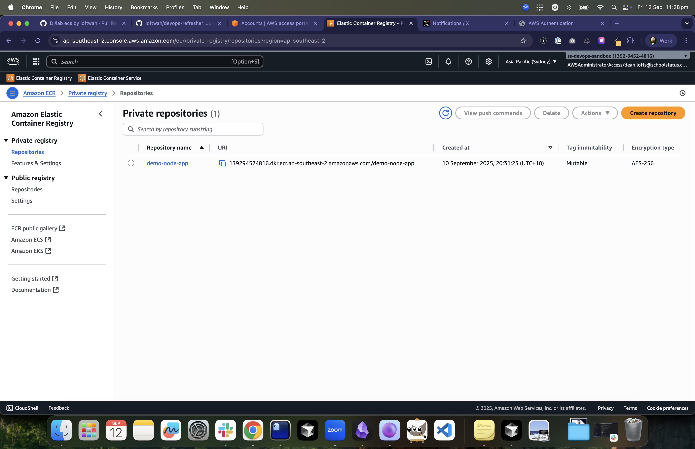
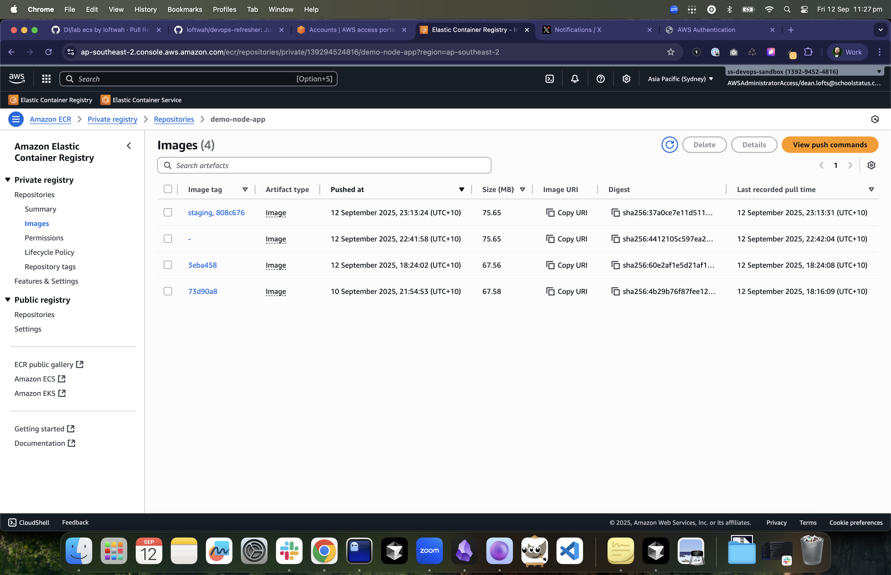
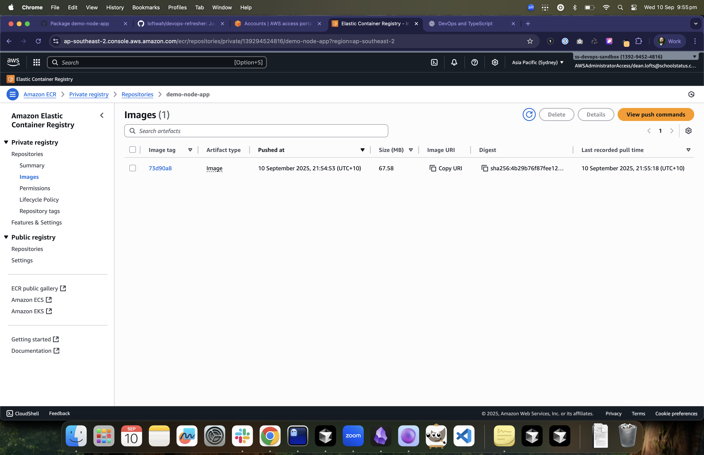

# ECR and Image Build

## Objectives

- Create an ECR repository and push a sample image for staging.
- Decide on base image sources and public registry mirroring.
- Add a simple lifecycle policy and scanning on push.

## Decisions

- Private images (your apps): push to ECR private repo(s).
- Public base images: prefer AWS ECR Public when available (fewer rate limits, regional mirrors). If you need Docker Hub or other registries, configure an ECR Pull Through Cache rule to avoid rate limits and centralize pulls.
- Tags: use immutable tags in CI (e.g., `git-sha`), plus a moving alias (e.g., `staging`) that always points to the latest.

## Tasks

1. Create `aws_ecr_repository` with:
   - `image_tag_mutability = "IMMUTABLE"` (recommended)
   - `image_scanning_configuration { scan_on_push = true }`
   - Optional KMS encryption (default AES256 is fine for staging)
2. Add a lifecycle policy (retain last 10 digests and the `staging` tag): `aws_ecr_lifecycle_policy`.
3. Docker login to ECR; build a sample image; tag and push `:staging` and `:<git-sha>`.
4. (Optional) Configure an ECR Pull Through Cache Rule for Docker Hub or another upstream registry.

Terraform for this lab lives in `aws-labs/03-ecr/` and uses backend state key `staging/ecr/terraform.tfstate`. By default, the repo mutability is set to `MUTABLE` to support a moving `:staging` tag during the lab. You can switch to `IMMUTABLE` via `-var image_tag_mutability=IMMUTABLE` if you prefer strictly immutable tags (you may need to delete the `staging` tag before re-tagging).

## Acceptance Criteria

- `aws ecr describe-images` shows the `:staging` tag and a recent SHA-tag.
- Repository has on-push scanning and a lifecycle policy attached.

Screenshots

- 
  ECR private repositories list showing demo repo.
- 
  Image tags `:staging` and immutable SHA.
- 
  Image metadata, scanning status, and digest.

## Notes on Base Images and Mirrors

- Prefer using ECR Public images where possible (e.g., `public.ecr.aws/docker/library/node:20-alpine`).
- If you need Docker Hub or ghcr.io, create a Pull Through Cache in ECR:
  - Registry: Docker Hub → `registry-1.docker.io` (or ghcr.io)
  - Update your Dockerfiles to pull via your ECR cache domain for consistent, rate-limit-resistant builds.

## CLI Snippets

Login and push:

```bash
aws ecr get-login-password --region $AWS_REGION --profile $AWS_PROFILE \
 | docker login --username AWS --password-stdin $(aws sts get-caller-identity --query 'Account' --output text).dkr.ecr.$AWS_REGION.amazonaws.com

REPO=$(aws ecr describe-repositories --repository-names demo-node-app --query 'repositories[0].repositoryUri' --output text)
docker build -t demo-node-app:staging .
docker tag demo-node-app:staging "$REPO:staging"
docker push "$REPO:staging"
```

Terraform apply (example):

```bash
cd aws-labs/03-ecr
terraform init
terraform apply -auto-approve \
  -var region=ap-southeast-2 \
  -var repo_name=demo-node-app \
  -var lifecycle_keep_last=10
```

## Terraform Hints

- `aws_ecr_repository`, `aws_ecr_lifecycle_policy`.
- Use outputs to surface the `repository_url` for CI.
- For CI, add a CodeBuild role with `ecr:BatchCheckLayerAvailability`, `ecr:PutImage`, `ecr:InitiateLayerUpload`, etc.
