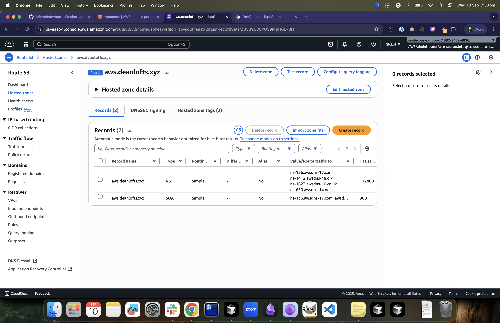

# DNS and Route 53 Lab



The domain for this lab is `aws.deanlofts.xyz`. It has been configured in Cloudflare and Route53.

```bash
~/gits/devops-refresher main !2 ?2 ❯ aws-labs/scripts/validate-delegation.sh
[INFO] NS (via 1.1.1.1):\nns-136.awsdns-17.com.
ns-1412.awsdns-48.org.
ns-1623.awsdns-10.co.uk.
ns-630.awsdns-14.net.
[ OK ] Delegation matches expected NS set
[ OK ] DNS delegation validation passed for aws.deanlofts.xyz
```
