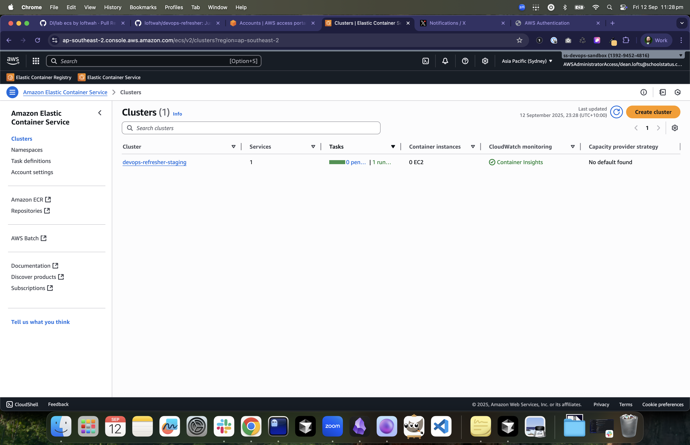
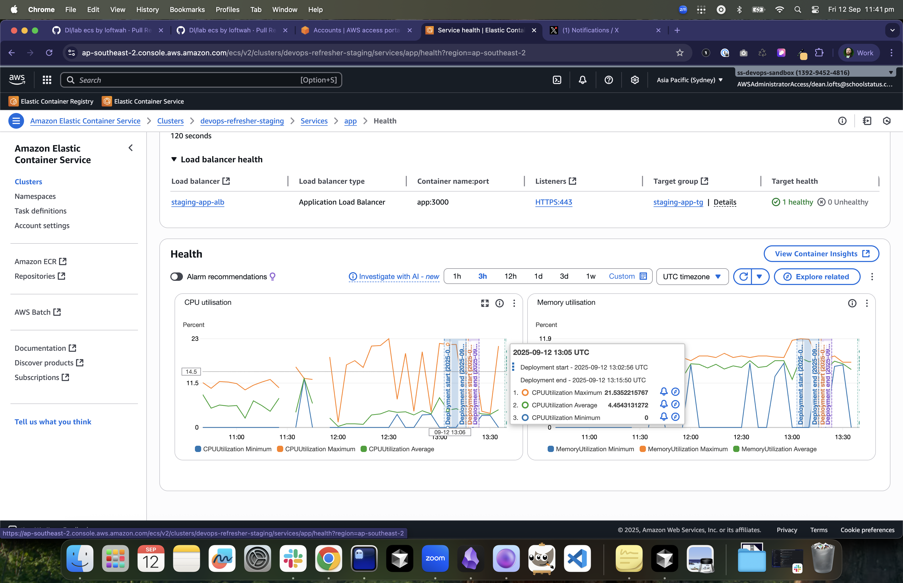

# ECS Cluster (Shared)

## Objectives

- Create a reusable ECS Fargate cluster for staging workloads.
- Enable Container Insights and a consistent CloudWatch Logs group.

## Tasks

1. Create `aws_ecs_cluster` named `devops-refresher-staging` with Container Insights enabled.
2. Create a CloudWatch log group `/aws/ecs/devops-refresher-staging` with 30‑day retention.
3. Output `cluster_name`, `cluster_arn`, and `log_group_name` for downstream labs.

Terraform for this lab lives in `aws-labs/13-ecs-cluster/`.

## Acceptance Criteria

- `aws ecs describe-clusters` shows the cluster active.
- Log group exists with the specified retention.

Screenshots

- 
  Cluster `devops-refresher-staging` active with Container Insights enabled.
- 
  Container Insights metrics for the staging cluster.

## Hints

- Keep this cluster generic so multiple services can deploy to it (e.g., `app`, `worker`).
- Downstream labs (service) should read the cluster/log outputs via remote state.
