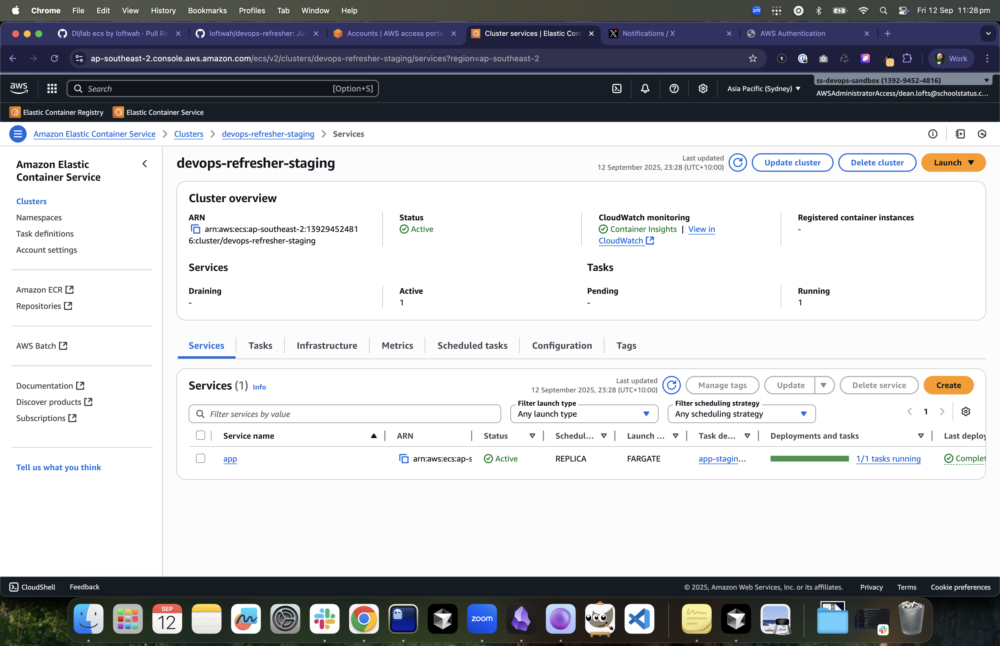
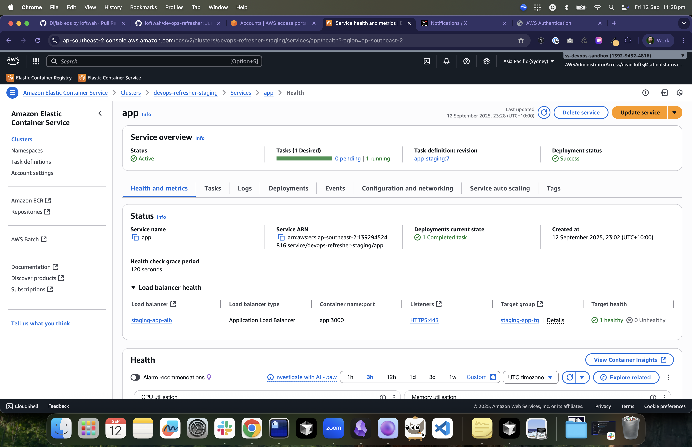
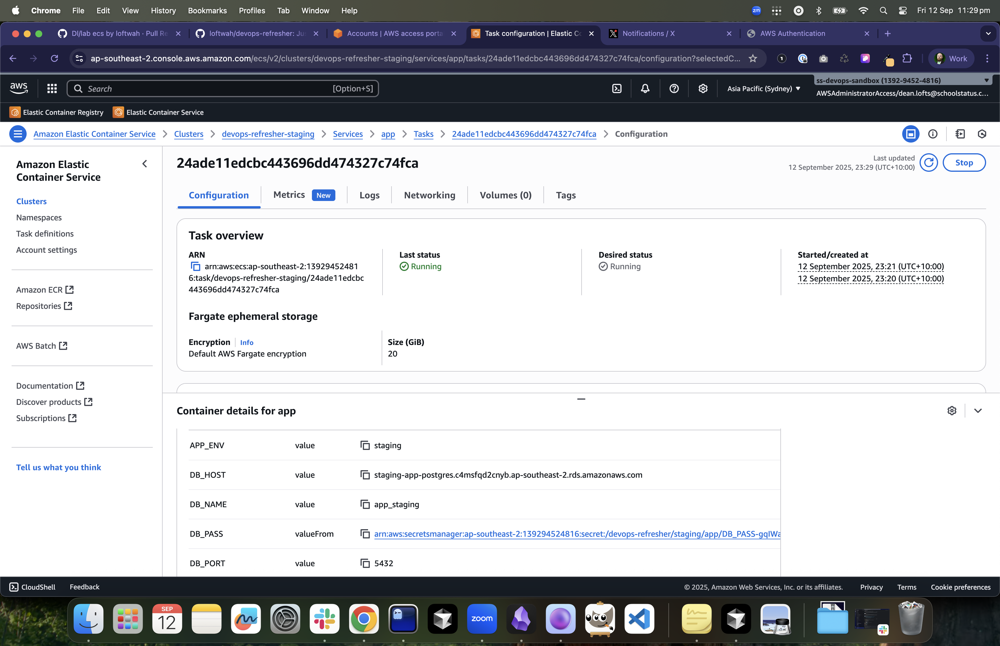
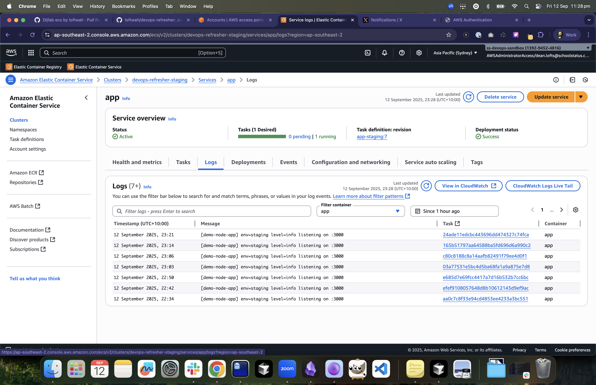
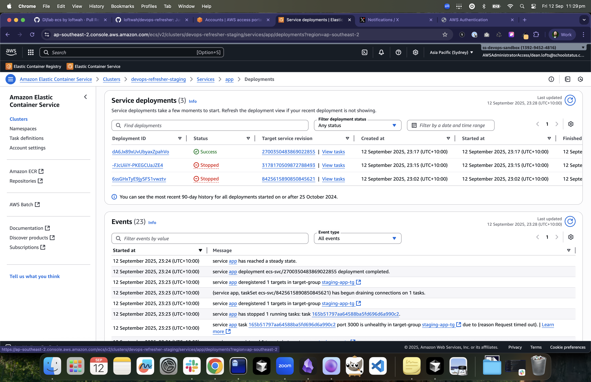

# ECS Service (App)

## Objectives

- Deploy the demo app as an ECS Fargate service behind the shared ALB.

## Tasks

1. Read remote state outputs for cluster, subnets, security groups, ALB target group, and IAM roles.
2. Define a task definition using the ECR image (default tag `:staging`), container name `app`, port `3000`, `awslogs` driver.
3. Create an ECS service with `launch_type = FARGATE`, attach to private subnets and the app security group, and wire the service to the ALB target group.
4. Enable Exec (optional) and set health check grace period.

Terraform for this lab lives in `aws-labs/14-ecs-service/`.

## Acceptance Criteria

- Service reaches steady state; target group shows healthy targets on `/healthz`.
- Updating the image tag to a new version rolls tasks without downtime.

Screenshots

- 
  Service `app` deployed on the staging cluster.
- 
  Health status, desired vs running count, and events.
- 
  Container `app` with awslogs to `/aws/ecs/devops-refresher-staging`.
- 
  Application logs streamed to CloudWatch.
- 
  Rolling deployment history for the service.

## Hints

- The container name in your task definition must match the name in `imagedefinitions.json` for CodePipeline deployments (`app`).
- Auto-populate environment and secrets from SSM/Secrets Manager using the provided module variables.
