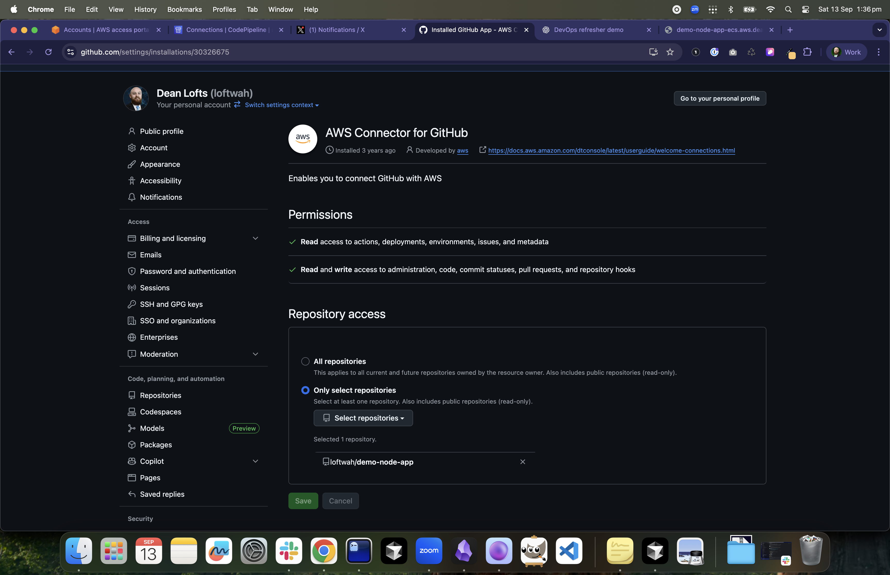
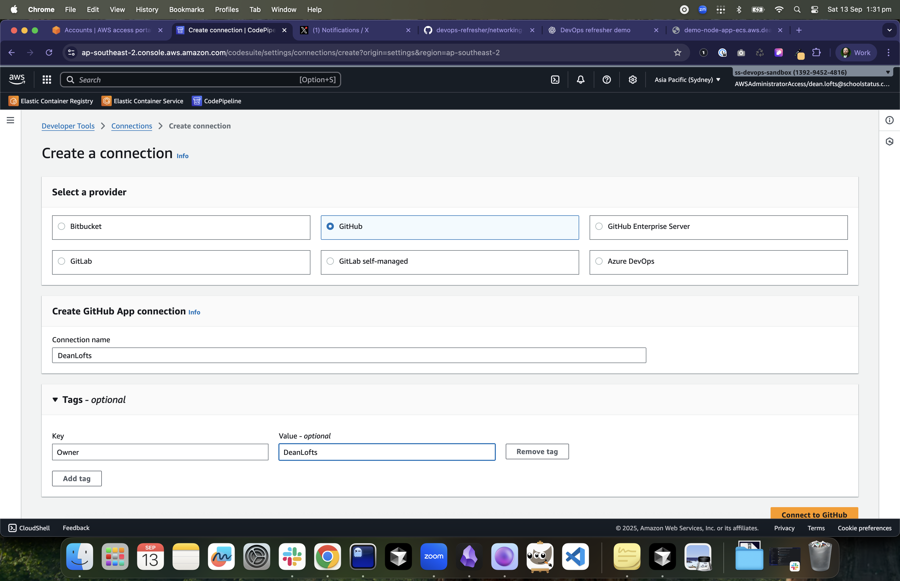
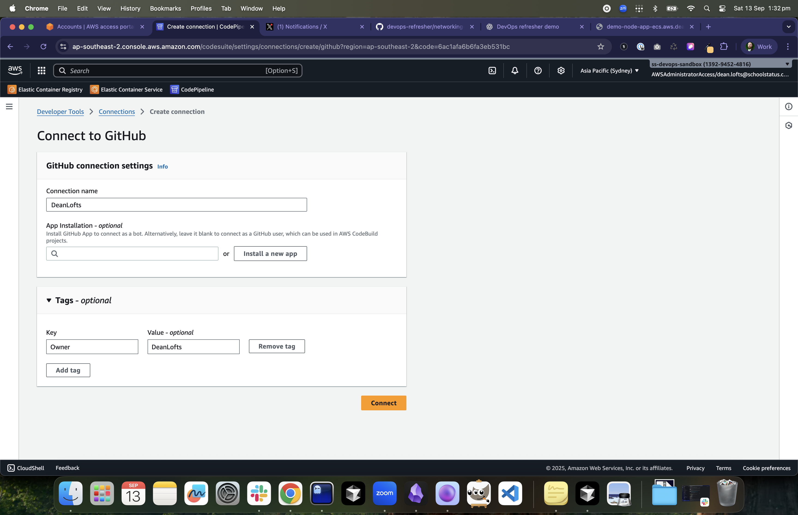
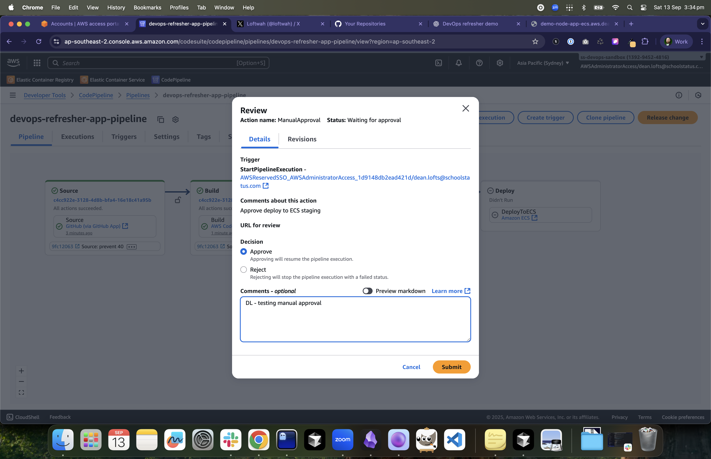
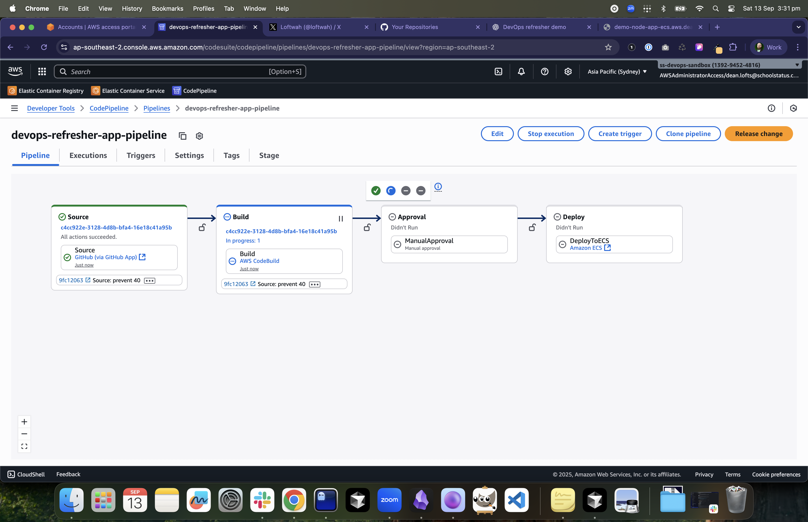

# CI/CD for ECS

## Objectives

- Build and deploy automatically on commit using CodeBuild/CodePipeline (or an alternative).

## Tasks

1. Create a CodeConnections (formerly CodeStar Connections) connection to GitHub (one-time, console handshake). See `images/github-aws-connector.png` and `images/codepipeline-github-connection*.png`.
2. CodeBuild project with IAM role: docker build, login to ECR, push; write `imagedefinitions.json` for ECS.
3. CodePipeline: Source (GitHub via Connection) → Build → Approval → Deploy (ECS deploy action reads `imagedefinitions.json`).
4. Manual approval stage required before deploy to staging.

Screenshots

- 
  GitHub CodeConnections setup in AWS Console.
- 
  CodePipeline using the GitHub Connection ARN.
- 
  Connection authorized to a single repository.
- 
  Manual Approval gate before ECS Deploy.
- 
  Pipeline running Build → Deploy.

## Acceptance Criteria

- Commit triggers build; pipeline pushes image and updates ECS task definition after approval.
- Service rolls to new tasks; ALB remains healthy.

## Hints

- GitHub via CodeConnections (CodeStar Connections in UI):
  - You already created the connection and limited it to a single repo. Default to this ARN: `arn:aws:codeconnections:ap-southeast-2:139294524816:connection/9cb5e242-3d9c-4b3c-8fec-fd3fdea9e37e`.
  - Source action in CodePipeline uses the Connection ARN and `FullRepositoryId` like `loftwah/demo-node-app`.
  - For GitHub user accounts, confirm the GitHub App has access to just that repo.
- Alternative: Use GitHub Actions + OIDC into AWS; skip CodePipeline and call Terraform/ECR/ECS via Actions.
- Keep buildspec in the app repo; pin tool versions for reproducibility.

## Terraform Lab

- See `aws-labs/15-cicd-ecs-pipeline` for the ready-to-run Terraform solution and walkthrough.
- Defaults:
  - `repo_full_name = loftwah/demo-node-app`
  - `connection_arn = arn:aws:codeconnections:ap-southeast-2:139294524816:connection/9cb5e242-3d9c-4b3c-8fec-fd3fdea9e37e`
  - `cluster_name = devops-refresher-staging`, `service_name = app`
  - `ecr_repo_name = demo-node-app`
  - Artifacts bucket: `devops-refresher-pipeline-artifacts-139294524816-apse2`

Note: The CodePipeline must be created in the same region as the CodeConnections ARN. Set `AWS_REGION=ap-southeast-2` when applying.

### Slack Notifications (optional)

- We use an SNS → Lambda Slack notifier pattern for CodePipeline and CodeBuild events. See `docs/slack-cicd-integration.md:3` to attach it to this pipeline.

### Slack Notifications (Build/Pipeline)

- Use EventBridge rules on CodeBuild and CodePipeline state changes to invoke your Slack notifier Lambda (see `slack-cicd-integration.md`).
- Typical events:
  - CodePipeline: `Execution State Change` and `Stage State Change`
  - CodeBuild: `Build State Change`
- Payload includes pipeline/build name, commit ID, and status; map these to Slack channels and formatting as per the notifier doc.

## Repo Naming Pattern (Demo Apps)

- `loftwah/demo-node-app`, `loftwah/demo-rails-app`, `loftwah/demo-go-service`.
- The app repo contains a Dockerfile, health endpoint, and minimal app code.
- Pipelines build/push to ECR, then deploy to ECS; the same image/tag is used by EKS.
