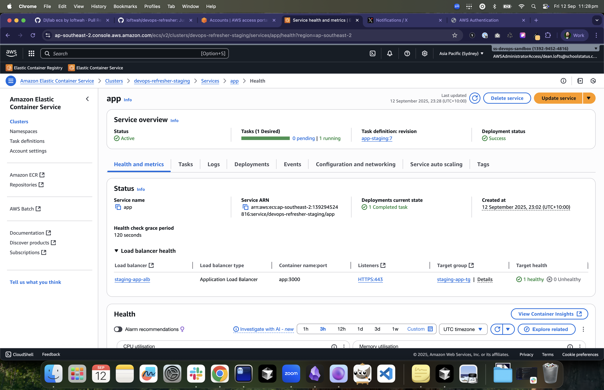

# ECS Staging Environment: End-to-End Walkthrough

Goal: Recreate a production-like staging environment for a containerized web app on AWS ECS (Fargate), using Terraform and CI/CD.

## Prerequisites

- AWS account + IAM admin (bootstrap only), then least-privileged roles.
- Route53 domain (or subdomain delegation) and ACM cert for HTTPS.
- Docker and a container image to deploy (or sample Nginx).
- Terraform remote backend (S3 with lockfile-based locking on Terraform v1.13+) ready.

## High-level Architecture

- Networking: VPC with public and private subnets across 2+ AZs; NAT for egress.
- Edge: ALB + HTTPS listeners → target groups.
- Compute: ECS Fargate cluster + services; one service per app.
- Images: ECR repositories per app.
- Config/Secrets: SSM Parameter Store / Secrets Manager.
- Observability: CloudWatch logs/metrics, dashboards, and alarms (see `aws-labs/16-observability.md`).
- CI/CD: CodeBuild + CodePipeline (or GitHub Actions) to build/push/deploy.

Illustrations

- 
  Service health and rollout status in ECS console.
- 
  Container Insights metrics at the cluster level.

## Build It Incrementally

1. Backend & scaffolding
   - Create S3 bucket; configure Terraform backend with lockfile-based locking.
   - Create a root `main.tf`, `providers.tf`, `variables.tf`, `outputs.tf`.
   - Add tagging locals and consistent naming patterns.

2. Networking (VPC & subnets)
   - VPC CIDR (e.g., 10.0.0.0/16), 2 public + 2 private subnets.
   - IGW, NAT, route tables per subnet group.
   - Validate: Subnets show in AWS console; route tables correct.

3. Security groups
   - ALB SG: Inbound 80/443 from world; egress anywhere.
   - ECS SG: Inbound from ALB SG only; egress anywhere (or via NAT).
   - Validate: Rules and references are as intended.

4. ECR repositories
   - Create `app` repo (e.g., `myapp-web`).
   - Validate: Push a test image; confirm tag appears.

5. IAM roles & policies
   - Task execution role (pull ECR, write logs to CloudWatch).
   - Task role (app’s runtime AWS permissions; least privilege).
   - Validate: `aws iam get-role` ARNs; confirm policies attached.

6. ECS cluster (Fargate)
   - Create ECS cluster with Container Insights optional.
   - Validate: Cluster visible; Fargate capacity provider available.

7. Log groups
   - Create CloudWatch log group per app (retention 14–30d for staging).
   - Validate: Log group exists; correct retention.

8. Load balancer
   - ALB across public subnets.
   - Target group for the service (port 80, HTTP health check `/health`).
   - Listener 443 → forward to target group; 80 → redirect to 443.
   - Validate: ALB DNS responds; health checks pending until tasks exist.

9. Parameters & secrets
   - SSM parameters for non-secret config; Secrets Manager for secrets.
   - IAM: Execution role must be able to read Secrets Manager under `/devops-refresher/<env>/app/*` (note the `/*`), and optional SSM read if using SecureString.
   - ECS service module will auto‑wire these into the task definition at apply time.
   - Include app auth secret by adding `APP_AUTH_SECRET` to secret keys:
     - `-var 'secret_keys=["DB_PASS","APP_AUTH_SECRET"]'`
   - Validate: `aws ssm get-parameter --with-decryption` (with right role).

10. Task definition

- Container image: `aws_account.dkr.ecr.region.amazonaws.com/myapp-web:staging`
- CPU/memory (e.g., 512/1024), port mapping 80:80, env vars, secrets.
- Logging: `awslogs` driver, log group name, region, stream prefix.
- Health check command optional (or rely on ALB check).
- Validate: Registered revision in ECS; JSON looks correct.

11. ECS service

- Fargate launch type, desired count 1–2.
- Associate with target group; enable deployment circuit breaker.
- Auto scaling (optional): scale on CPU >= 60%.
- Validate: Tasks running; target group healthy; ALB serving 200 OK.

12. Observability

- Metrics: ALB 5XX, Target 5XX, HealthyHostCount, ECS CPU/Memory.
- Alarms: Page on 5XX bursts; notify on failed deployments.
- Dashboards: Overview per service + LB.

13. CI/CD

- Build: Docker build → push to ECR → export image URI artifact.
- Deploy: Update task definition image → deploy ECS service.
- Options: CodePipeline/CodeBuild, or GitHub Actions + OIDC.
- Validate: Commit triggers build and rollout; deploy is safe-to-retry.

## Doing One Resource at a Time (Why it’s smart)

- Faster feedback: Smaller `plan/apply` cycles catch mistakes early.
- Safer rollbacks: Fewer dependencies to unwind when reverting.
- Clear ownership: Easy to tag/trace costs and blast radius.

## How to find details when unsure

- Terraform Registry (resource docs, arguments, examples).
- AWS Console + `aws` CLI `list/describe` calls to inspect real values.
- CloudWatch and ALB error pages for health/target group debugging.
- Git logs and prior modules for proven patterns.

## State Management Tips

- Separate state per environment (`staging`, `prod`) and major domain (networking, ecs, cicd) if needed to reduce blast radius.
- Protect state buckets with bucket policies; enable versioning + encryption.
- Use `-target` only for break-glass; prefer explicit module boundaries.

## Validation Checklist (staging)

- VPC/subnets/RTs/NAT are correct across 2+ AZs.
- ALB DNS answers; listeners configured; target group health OK.
- ECR image present; task definition references the correct tag.
- Task execution role has ECR + CloudWatch Logs permissions.
- ECS service stable; deployment circuit breaker not tripping.
- Logs flowing in CloudWatch; 2XX on health endpoints.
- Parameters/secrets resolved in container env.
