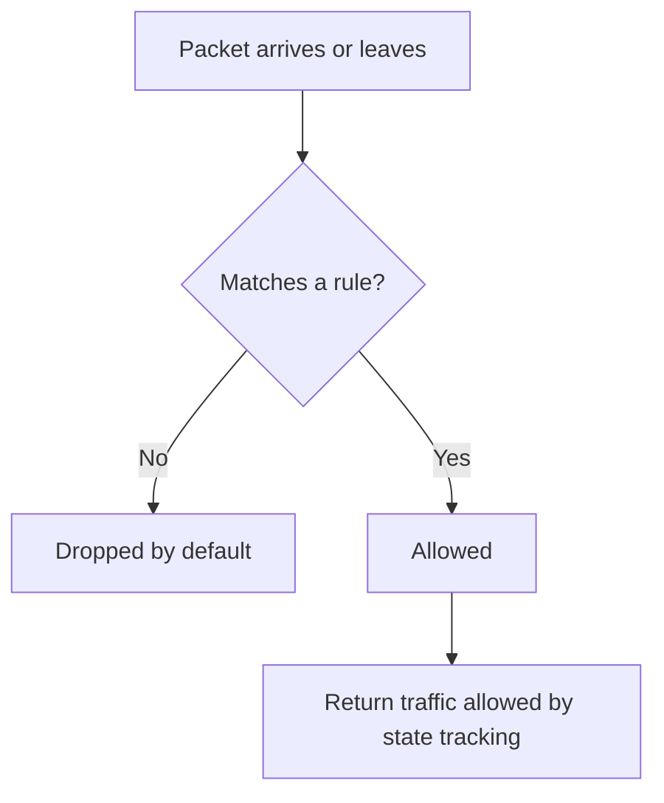
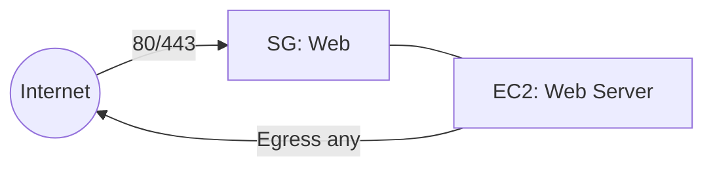
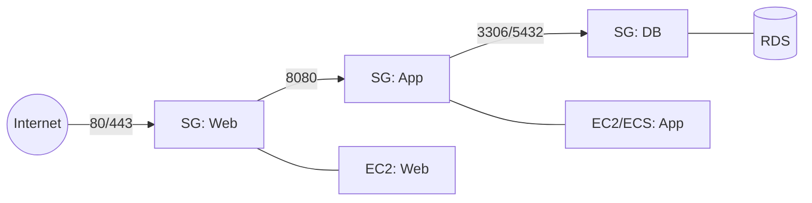
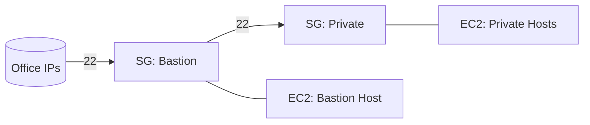
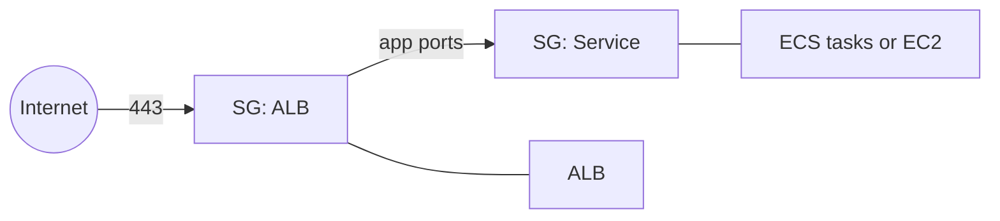
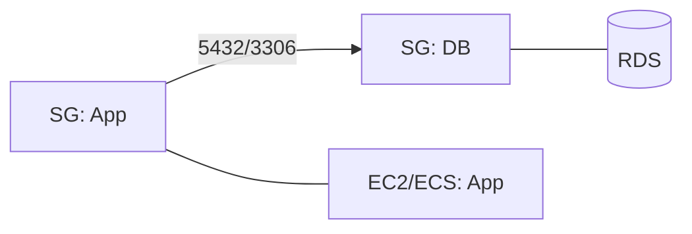

# AWS Security Groups Explanation

## 1. What Security Groups Are

Security Groups are stateful virtual firewalls attached to resources such as EC2, ALB or NLB, and RDS. They control inbound and outbound traffic with allow rules only. Responses to allowed traffic are automatically allowed back.

---

## 2. Core Concepts

- Inbound rules: what can reach the resource.
- Outbound rules: what the resource can reach.
- Protocol and port: TCP, UDP, ICMP and specific ports.
- Source or destination: a CIDR block or another Security Group in the same VPC, or in a peered VPC in the same Region.
- Multiple SGs on one resource: all allow rules are aggregated.

---

## 3. Evaluation Logic

- Default: deny everything.
- Allows only: there are no explicit deny rules.
- Stateful: replies to allowed flows are permitted without additional rules.

---

## 4. Remote Access: Prefer SSM Session Manager

AWS Systems Manager (SSM) Session Manager is the preferred way to access instances and containers. It removes the need to open inbound admin ports (e.g., SSH 22, RDP 3389) and provides stronger controls and auditing.

- Why it’s better:
  - No inbound ports: security groups can have zero admin ingress.
  - IAM-based auth: fine-grained access via roles, policies, and permissions boundaries.
  - Auditability: session logs to CloudWatch Logs or S3; tie actions to identities.
  - Works in private subnets: instances initiate egress to SSM; use VPC endpoints to avoid Internet/NAT.
  - Port forwarding and file copy: replace ad‑hoc bastions and SSH tunnels; supports ECS Exec for containers.

- Where it can be used:
  - EC2 instances with SSM Agent and an instance profile that allows `ssm:*`, `ec2messages:*`, and `ssmmessages:*` actions.
  - ECS tasks using ECS Exec (backed by SSM Session Manager).
  - On‑prem or other clouds via SSM hybrid activation (if needed).

- Network prerequisites:
  - Allow egress HTTPS (TCP 443) from instances/tasks to SSM endpoints.
  - For fully private access, create interface VPC endpoints for `com.amazonaws.<region>.ssm`, `ec2messages`, and `ssmmessages` and route traffic to them; then you can block Internet egress.

- Practical result for SGs:
  - You generally remove SSH/RDP ingress rules.
  - Keep or restrict egress as needed (e.g., HTTPS to SSM endpoints only).

If you must keep SSH (e.g., legacy tooling), tightly scope sources to office CIDRs, use short‑lived access, and prefer a just‑in‑time workflow.

---

## 5. Simple Example: Web Access (SSH optional)

Expose only the application ports publicly. Prefer SSM instead of SSH for admin access.

Inbound rules on SG: Web

- TCP 80 from 0.0.0.0/0
- TCP 443 from 0.0.0.0/0

Outbound rules on SG: Web

- All traffic allowed

With SSM:

- Remove SSH (22) entirely. Ensure the instance profile and SSM VPC endpoints (or NAT) are present.

If SSH is required (legacy):

- TCP 22 from approved admin CIDRs only (e.g., 203.0.113.10/32), and consider time‑bound rules.

---

## 6. The “Middle SG” Pattern with SG Referencing

Security Groups can reference other SGs as the source or destination. This lets you gate traffic between groups of resources by membership, not IPs.

### 6.1 Three-tier app: Web → App → DB

- SG: Web inbound 80 and 443 from 0.0.0.0/0
- SG: App inbound 8080 from SG: Web
- SG: DB inbound DB port from SG: App

### 6.2 Bastion access (legacy; prefer SSM)

- SG: Bastion inbound 22 from office CIDRs
- SG: Private inbound 22 from SG: Bastion

Prefer SSM Session Manager and remove the bastion entirely where possible. Keep a bastion only when SSM cannot be used (e.g., unsupported systems, strict segregation with no SSM agent/role, or vendor‑specific workflows). If retained, restrict sources, enable MFA, and log commands.

### 6.3 Load balancer fronting services

- SG: ALB inbound 443 from 0.0.0.0/0
- SG: Service inbound app ports from SG: ALB

---

## 7. RDS with SG Referencing

Attach SG: App to your app instances and SG: DB to the database. On SG: DB, allow the DB port from SG: App. This grants DB access to all present and future app instances by SG membership rather than IP addresses.

Tip with SSM: you can use SSM port forwarding to reach RDS from your workstation through an EC2 instance in the VPC, avoiding public DB access and static bastions.

---

## 8. Cross-VPC Notes

- You can reference a security group in a **peered VPC in the same Region** when the peering connection is active.
- For cross-Region peering, use CIDR rules rather than SG references.

---

## 9. Choosing a Design: Simple vs Three-Tier

- Simple SG setup: use when the footprint is small (a single web service, a utility VM, a prototype) and blast radius is limited.
  - Why: minimal rules to manage, easier troubleshooting, fast delivery.
  - How: one SG per component with only required public ports; prefer SSM for admin; allow targeted egress to dependencies. Example: `SG: Web` allows 443 from `0.0.0.0/0`; no SSH; egress HTTPS for updates/SSM.

- Three-tier SG setup (Web → App → DB): use when you have multiple instances/services, autoscaling, shared databases, or compliance requirements.
  - Why: least privilege by membership, strong blast‑radius isolation, scales without IP changes, clean service boundaries.
  - How: `SG: Web` allows 443 from Internet; `SG: App` allows only from `SG: Web`; `SG: DB` allows only from `SG: App`; no direct Internet to App/DB; admin via SSM.

Rule of thumb: start simple, move to three‑tier when you add more services, a shared DB, or a second consumer of a tier. Always prefer SSM over opening admin ports.

---

## 10. Practical Hygiene

- Prefer targeted egress rules instead of allow all, where feasible.
- Avoid relying on the default SG. Create least-privilege SGs for each role or tier.
- Test flows with VPC Reachability Analyzer and verify health checks and target ports when using ALB or NLB.
- Centralize remote access with SSM; add VPC endpoints for SSM to keep instances private.

---

## 11. Summary

- Security Groups are stateful, allow-only firewalls.
- SG-to-SG references let you build layered access based on membership.
- Use patterns like Web → App → DB, Bastion → Private, and ALB → Services for clean, scalable designs.
- Prefer SSM Session Manager over SSH/RDP; remove admin ingress where possible.
- Choose simple SGs for small footprints; adopt three‑tier SGs as complexity and sharing increase.
