# What a Senior DevOps Engineer Should Know About Computer Networks

## 1. OSI vs TCP/IP and where HTTP fits

- What it is: OSI is a seven‑layer reference model for reasoning and troubleshooting. TCP/IP is the stack we actually configure on hosts and routers. HTTP is an application‑layer protocol that runs over a transport such as TCP or QUIC.
- Why it matters: Picking the right model helps you bound faults quickly and choose the correct configuration knobs.

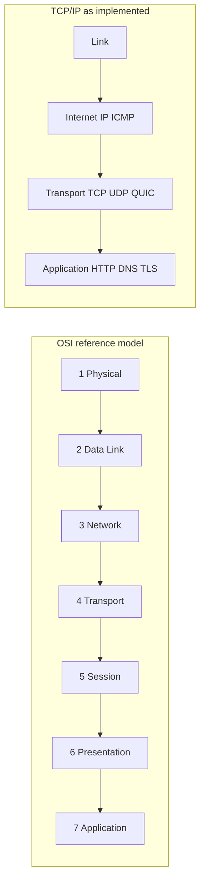

Operate it in incidents

- Use OSI names to bound the fault. If hosts in one VLAN cannot ARP each other, that is Layer 2. If the default route is missing, that is Layer 3. If SYN packets leave but there is no SYN ACK, that is often Layer 4 or a stateful device.
- Use TCP/IP terms when configuring. You do not configure a Layer 5 setting on Linux. You configure TLS libraries, sockets, routes, and firewall rules.

Glossary you'll reuse

- ARP Address Resolution Protocol IPv4 to MAC mapping at Layer 2.
- NDP Neighbour Discovery Protocol IPv6 neighbour and router discovery.
- VLAN Virtual LAN using IEEE 802.1Q tags at Layer 2.
- STP Spanning Tree Protocol loop prevention at Layer 2.
- SVI Switch Virtual Interface a routed interface bound to a VLAN.
- LACP Link Aggregation Control Protocol 802.1AX bonding multiple links.
- VRF Virtual Routing and Forwarding separate routing tables on one device.
- CIDR Classless Inter Domain Routing flexible prefix lengths like 10.0.0.0/16.

---

## 2. HTTP the protocol and why versions matter

- What it is: HTTP defines request/response semantics (methods, status codes, headers, caching) and can run over different transports.
- Why it matters: Version and transport affect latency, multiplexing, and behaviour under loss or high RTT.

* HTTP/1.1 over TCP text framing with persistent connections. Serialising requests on one connection causes application head‑of‑line blocking.
* HTTP/2 over TCP binary frames and multiplexed streams on a single TCP connection. If TCP loses one segment, all streams on that connection pause until recovery.
* HTTP/3 over QUIC QUIC runs over UDP and provides streams without TCP head‑of‑line blocking. It integrates TLS 1.3 in the transport. Expect a faster handshake and better loss behaviour on lossy or high RTT paths.

Operate it

- Expose HTTP/2 and HTTP/3 at edges where your CDN or load balancer supports them. Keep HTTP/1.1 for fallbacks and legacy clients.
- During incidents, confirm what negotiated, then test alternates:

```bash
curl -v --http3 https://svc.example.com
curl -v --http2 https://svc.example.com
curl -v --http1.1 https://svc.example.com
```

What to look for in captures

- HTTP/1.1 look for serialised requests and slow responses when a single object is large.
- HTTP/2 look for stream resets and large bursts that correlate with TCP retransmissions.
- HTTP/3 look for multiple QUIC streams and transport errors. If a firewall blocks UDP/443 you may fall back to HTTP/2.

---

## 3. Physical media copper, fibre, optics, PoE

- What it is: The physical layer covers cables, optics, and power delivery.
- Why it matters: Many “mysterious” outages come from signal quality, dirty connectors, or power budget limits, not protocols.

### Copper twisted pair

- Cat5e one gigabit to 100 m. Some 2.5 GBASE T works on short good runs, but treat it as best effort.
- Cat6 one gigabit to 100 m, ten gigabit to about 55 m in dense bundles because of alien crosstalk.
- Cat6a ten gigabit to 100 m. Baseline for new runs in comms rooms.
- Cat8 25 or 40 gigabit to 30 m for top of rack and short room runs.

How to not get bitten

- Use factory made patch leads and test with a certifier where you can.
- Leave autonegotiation on both ends unless you have a documented reason. Hard setting one end and leaving the other on auto is a classic duplex mismatch.

### Fibre the parts that matter

Multimode fibre MMF

- Core is larger and supports many light paths modes. Cheap optics.
- Designations are OM3, OM4, OM5.
- Typical use short to medium runs inside rooms and buildings such as aggregation to distribution or server uplinks in the same row.
- Limits are about modal dispersion different modes arrive at different times. Modern optics mitigate some of this with better lasers and encoding.

Single mode fibre SMF

- Small core, one mode, laser light. Designation OS2.
- Typical use campus, building to building, metro, anything that might scale past 100 Gbps later.
- Because there is one mode, you avoid modal dispersion and can push much longer distances with the right optics.

Connectors and cleanliness

- LC connectors are the modern default on switch SFP cages. SC is still seen on older panels.
- Keep ferrules clean. A single speck of dust can increase bit error rates. If you see incrementing input errors and tiny packet loss under load, inspect and clean.

Optics and form factors

- SFP 1G. SFP plus 10G. SFP28 25G. QSFP28 100G. QSFP56 200G. QSFP DD 400G. The cage is a form factor. Speed is determined by the optic.
- Common optic codes by reach and medium
  - SR short reach over multimode.
  - LR long reach over single mode.
  - ER extended reach over single mode.
  - ZR very long reach over single mode.
    Check the data sheet for supported fibre type, launch power, receive sensitivity, and the optical budget. Do not trust folklore distances.

### PoE Power over Ethernet

Useful for phones, access points, and cameras. Know the per port and total power budget.

- 802.3af PoE up to about 13 W at the device.
- 802.3at PoE plus up to about 25 W.
- 802.3bt Type 3 up to about 51 W.
- 802.3bt Type 4 up to about 71 W.

---

## 4. Layer 2 MAC, ARP, NDP, VLANs, Spanning Tree

- What it is: Layer 2 moves frames inside a broadcast domain using MAC addresses.
- Why it matters: Most “can’t reach my neighbour” issues are L2 CAM tables, ARP/NDP, VLAN tags, or loops.

How a host talks to its neighbour in the same subnet

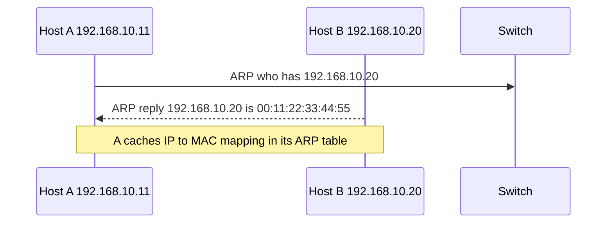

- CAM table content addressable memory on the switch maps destination MAC to output port.
- ARP IPv4 neighbour resolution. Look for entries stuck in incomplete if traffic is not flowing.
- IPv6 uses NDP Neighbour Discovery Protocol. It also includes Router Advertisements RA for stateless addressing and Duplicate Address Detection DAD.

VLANs and trunks

- An access port carries a single VLAN.
- A trunk carries many and tags frames with 802.1Q.
- Keep the concept of a native VLAN minimal and documented. A mismatch produces silent leaks across VLANs.

Spanning Tree Protocol STP

- Goal prevent loops. Without it, a looped frame multiplies and brings the segment down.
- Use RSTP Rapid STP or MSTP Multiple STP in modern designs.
- Keep Layer 2 domains small and push Layer 3 to the access so STP does very little.

STP viewed on a dual homed access switch

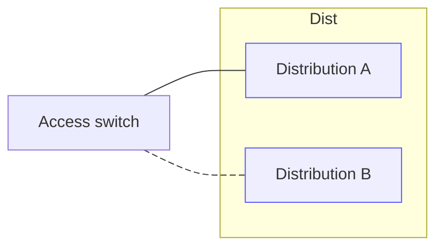

The dashed link is likely in a blocking state. Routed access removes this behaviour by making both links Layer 3.

Deeper STP: roles, convergence, and failure modes

- What it is: STP/RSTP elect a root bridge and assign port roles (Root, Designated, Alternate/Blocking) to prevent loops.
- Why it matters: Misconfiguration or accidental loops cause broadcast storms, MAC flapping, and brownouts that look like intermittent application failure.

Roles and a simple tree

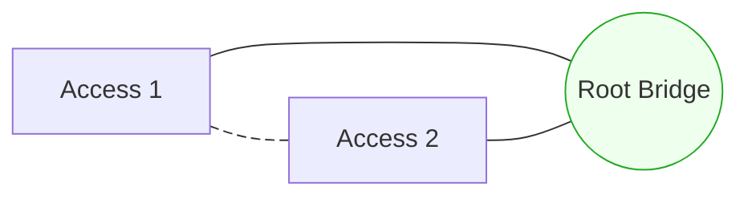

- The dashed A—B link blocks to prevent a loop. If RB fails, RSTP reconverges and may unblock A—B.
- Elect the root deterministically by setting bridge priority on your distribution/core. Do not let it “float”.

What a broadcast storm looks like

```mermaid
sequenceDiagram
  participant H as Host A
  participant S1 as Switch 1
  participant S2 as Switch 2
  Note over S1,S2: Loop exists between S1 and S2; STP disabled/misconfigured
  H->>S1: ARP Request (broadcast)
  S1->>S2: Flood (broadcast)
  S2->>S1: Flood back (loop)
  S1->>S2: Flood again (amplified)
  Note over S1,S2: Exponential growth saturates links and CPUs
```

Lab: build and observe a safe L2 loop on Linux

- Goal quickly demonstrate a loop and broadcast amplification in disposable namespaces. Do NOT run on production hosts.
- Linux bridges default STP off; observe the storm, then enable STP and watch one link block.

```bash
# Namespaces
sudo ip netns add ns1
sudo ip netns add ns2
sudo ip netns add host

# Two parallel interconnects (creates a loop between the two bridges)
sudo ip link add a1 type veth peer name a2
sudo ip link add b1 type veth peer name b2

# Host attachment
sudo ip link add h type veth peer name hp

# Move ends into namespaces
sudo ip link set a1 netns ns1; sudo ip link set b1 netns ns1
sudo ip link set a2 netns ns2; sudo ip link set b2 netns ns2
sudo ip link set h netns host; sudo ip link set hp netns ns1

# Create bridges
sudo ip -n ns1 link add br0 type bridge
sudo ip -n ns2 link add br0 type bridge

# Attach ports to bridges
sudo ip -n ns1 link set a1 master br0
sudo ip -n ns1 link set b1 master br0
sudo ip -n ns1 link set hp master br0
sudo ip -n ns2 link set a2 master br0
sudo ip -n ns2 link set b2 master br0

# Bring links up
for n in ns1 ns2; do
  sudo ip -n $n link set br0 up
  for i in a1 b1 a2 b2 hp; do sudo ip -n $n link set $i up 2>/dev/null || true; done
done
sudo ip -n host link set h up

# Give the host an IP in a fake VLAN and generate ARP
sudo ip -n host addr add 192.168.50.10/24 dev h
sudo ip -n host arping -I h -c 100 192.168.50.20 &

# Watch broadcast/multicast frames explode with STP off
sudo ip -n ns1 tcpdump -ni br0 -vv 'broadcast or multicast' &
sudo ip -n ns2 tcpdump -ni br0 -vv 'broadcast or multicast' &

# Now enable STP to stop the storm (RSTP requires userspace; basic STP shown)
sudo ip -n ns1 link set dev br0 type bridge stp_state 1
sudo ip -n ns2 link set dev br0 type bridge stp_state 1
```

Signs you will see in the wild

- MAC flapping logs: the same MAC moves rapidly between two ports that form a loop.
- CPU spikes on access switches and high broadcast/multicast counters on interfaces.
- DHCP offers/acks failing intermittently; ARP tables constantly churning.

Prevent loops at the edge (vendor‑style examples)

Cisco IOS/IOS‑XE

```text
interface Gi1/0/10
 switchport mode access
 spanning-tree portfast
 spanning-tree bpduguard enable
 storm-control broadcast level 1.00 0.50
 storm-control action shutdown
```

Arista EOS

```text
interface Ethernet1
 spanning-tree portfast
 spanning-tree bpduguard enable
 storm-control broadcast level pps 1000
```

- Enable PortFast on user/server access ports so they skip STP listening/learning.
- Enable BPDU Guard on PortFast ports; shut the port if a BPDU is seen (signals an accidental loop via unmanaged switch).
- Configure storm control (broadcast/multicast/unknown‑unicast) with sane thresholds to cap damage.
- Prefer routed access or MLAG/VPC to avoid STP blocking on uplinks.

Common Layer 2 pitfalls you can detect quickly

- Native VLAN mismatch on a trunk: untagged frames leak between VLANs. Symptom: ARP entries resolve to unexpected MAC/VLAN.
- VLAN pruning/allow lists: required VLAN missing on one side of a trunk; hosts can talk in one direction only via asymmetric flooding.
- LACP mode mismatch: one side `active`, the other `on` (static) causes hashing/blackholing. Use `active`/`passive` and verify partner state.
- Asymmetric MTU inside a VLAN (tunnelling overlays, QinQ): PMTUD blackholes and odd drops. Verify `ip link` MTU and test with `ping -M do -s`.

Visualising a native VLAN mismatch

```mermaid
flowchart LR
  subgraph SW1
    A1[Port gi1  VLAN 10 access]
    T1[Trunk gi2 native 10 allow 10,20]
  end
  subgraph SW2
    A2[Port gi1  VLAN 20 access]
    T2[Trunk gi2 native 20 allow 10,20]
  end
  A1-- untagged -->T1-- untagged -->T2-- untagged -->A2
  note right of A2: Host in VLAN20 receives frames from VLAN10
```

Operate it

- Intentionally set root bridge priority and secondary root per VLAN/instance.
- Keep STP diameter small; push L3 to the edge so STP rarely needs to act.
- During incidents, check: root bridge MAC, port roles on each hop, MAC table stability, and interface storm‑control counters.

References and primers

- Spanning Tree Protocol overview: https://en.wikipedia.org/wiki/Spanning_Tree_Protocol
- Rapid STP (802.1w) basics: https://en.wikipedia.org/wiki/Spanning_Tree_Protocol#Rapid_Spanning_Tree_Protocol
- Broadcast storm: https://en.wikipedia.org/wiki/Broadcast_storm
- Linux bridge how‑to: `man 8 bridge`

---

## 5. Switches and routers what they do and how to use them together

- What it is: Switches forward frames within a broadcast domain; routers forward packets between subnets.
- Why it matters: Knowing where to place L3 boundaries simplifies fault isolation and keeps failure domains small.

Design pattern you can defend in a review

- Small Layer 2 domains per access block.
- Inter VLAN routing on distribution or on routed access switches using SVIs.
- Aggregate server NICs with LACP to remove single uplink bottlenecks.
- VRFs to separate tenant or environment routing tables when VLAN boundaries are not enough.

---

## 6. IP addressing IPv4 and IPv6

- What it is: IP addressing labels interfaces so packets can be routed end to end.
- Why it matters: Clean, documented addressing plans prevent collisions, confusing NATs, and brittle firewall rules.

IPv4

- 32 bits written as dotted decimal. Use CIDR prefixes such as 10.20.30.0/24.
- Private address blocks RFC 1918 are 10.0.0.0/8, 172.16.0.0/12, 192.168.0.0/16.
- APIPA Automatic Private IP Addressing 169.254.0.0/16 is link local only and usually indicates DHCP failure.

IPv6

- 128 bits written in hex with shorthand rules.
- Address types you will actually provision
  - Link local fe80::/10.
  - Unique Local Addresses ULA fc00::/7 for internal only.
  - Global unicast 2000::/3 for routed.

- Use a /64 per LAN. Do not try to save by carving host bits.
- Host addressing can come from SLAAC Stateless Address Autoconfiguration or from DHCPv6.

---

## 7. Subnet masks and CIDR step by step examples

- What it is: CIDR uses variable‑length prefixes to size networks to fit.
- Why it matters: Right‑sized subnets reduce waste while keeping broadcast domains manageable.

Definitions

- Prefix length the /n bit count.
- Subnet mask dotted decimal mask that aligns with the prefix.
- Network address the lowest address in the block.
- Broadcast address the highest address in an IPv4 block larger than a /31.

Worked example hosts first

- Requirement two subnets for about 50 hosts each.
- Formula usable hosts 2^(32 − prefix) minus 2.
- /26 has 64 addresses and 62 usable. Mask is 255.255.255.192.
- If the parent block is 192.168.10.0/24, the four /26s are:
  1. 192.168.10.0/26 usable .1 to .62 broadcast .63
  2. 192.168.10.64/26 usable .65 to .126 broadcast .127
  3. 192.168.10.128/26 usable .129 to .190 broadcast .191
  4. 192.168.10.192/26 usable .193 to .254 broadcast .255

Worked example subnets first

- Parent 10.20.0.0/16. Need six equal subnets.
- Each extra prefix bit doubles the subnet count.
- /19 gives 8 subnets plenty. Each is 8190 usable hosts.
- The third octet steps by 32 0, 32, 64, 96, 128, 160, 192, 224.

Finding a network for an IP by hand

- Example 192.168.14.37/27.
- /27 mask is 255.255.255.224 so the block size in the last octet is 256 minus 224 equals 32.
- The blocks are 0, 32, 64, 96, 128, 160, 192, 224.
- 37 falls in 32 to 63.
- Network 192.168.14.32/27. Usable .33 to .62. Broadcast .63.

Why /31 and /32 exist

- /31 is great for point to point links. There is no broadcast. Both addresses are usable.
- /32 is a single host loopbacks and virtual IPs. These are vital for routing protocol stability and for addressing services on multi homed hosts.

---

## 8. Subnetting cheat sheet with examples

- What it is: Handy reference for common IPv4 subnet sizes.
- Why it matters: You’ll size VLANs, point‑to‑point links, and management networks quickly during design and incidents.

Quick table for IPv4

| Prefix | Mask            | Addresses | Usable | Block step in varying octet | Typical use          |
| -----: | --------------- | --------- | -----: | --------------------------: | -------------------- |
|    /32 | 255.255.255.255 | 1         |      1 |                           1 | loopbacks, VIPs      |
|    /31 | 255.255.255.254 | 2         |      2 |                           2 | point to point       |
|    /30 | 255.255.255.252 | 4         |      2 |                           4 | legacy p2p           |
|    /29 | 255.255.255.248 | 8         |      6 |                           8 | tiny management nets |
|    /28 | 255.255.255.240 | 16        |     14 |                          16 | device VLANs         |
|    /27 | 255.255.255.224 | 32        |     30 |                          32 | small office VLANs   |
|    /26 | 255.255.255.192 | 64        |     62 |                          64 | medium VLANs         |
|    /25 | 255.255.255.128 | 128       |    126 |                         128 | large VLANs          |
|    /24 | 255.255.255.0   | 256       |    254 |            1 in third octet | route boundaries     |
|    /23 | 255.255.254.0   | 512       |    510 |            2 in third octet | bigger segments      |
|    /22 | 255.255.252.0   | 1024      |   1022 |            4 in third octet | summarisation        |
|    /21 | 255.255.248.0   | 2048      |   2046 |            8 in third octet | AZ wide management   |
|    /20 | 255.255.240.0   | 4096      |   4094 |           16 in third octet | DC row blocks        |
|    /19 | 255.255.224.0   | 8192      |   8190 |           32 in third octet | regional blocks      |
|    /18 | 255.255.192.0   | 16384     |  16382 |           64 in third octet | regional blocks      |
|    /17 | 255.255.128.0   | 32768     |  32766 |          128 in third octet | large site           |
|    /16 | 255.255.0.0     | 65536     |  65534 |           1 in second octet | campus or VPC scope  |

Visualising a split

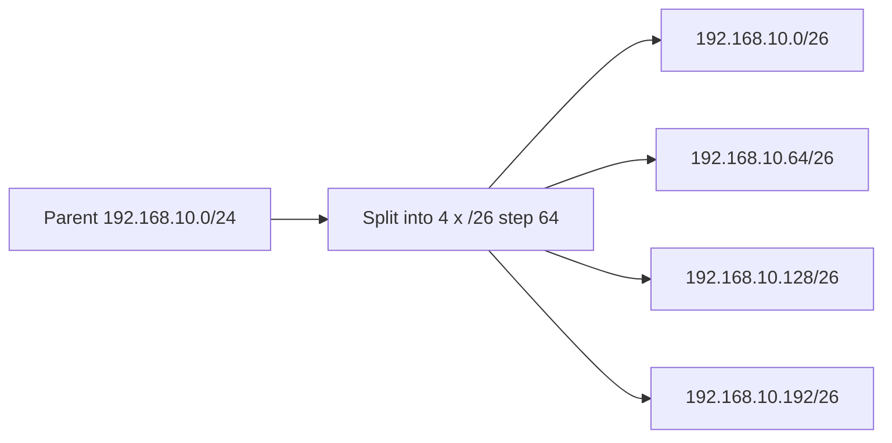

IPv6 reminders

- Use a /64 per LAN. Hosts rely on that size for SLAAC.
- Plan with /48 or /56 per site so you can hand out as many /64s as you need.
- There is no broadcast in IPv6. Use NDP for neighbour discovery.

---

## 9. Services DHCP and APIPA

- What it is: DHCP automates address assignment; APIPA is IPv4 link‑local self‑assignment when DHCP fails.
- Why it matters: Misconfigured DHCP or helpers cause widespread outages and puzzling 169.254.x.x addresses.

DHCPv4 performs DORA Discover, Offer, Request, Acknowledge. It also carries options such as default gateway and DNS.

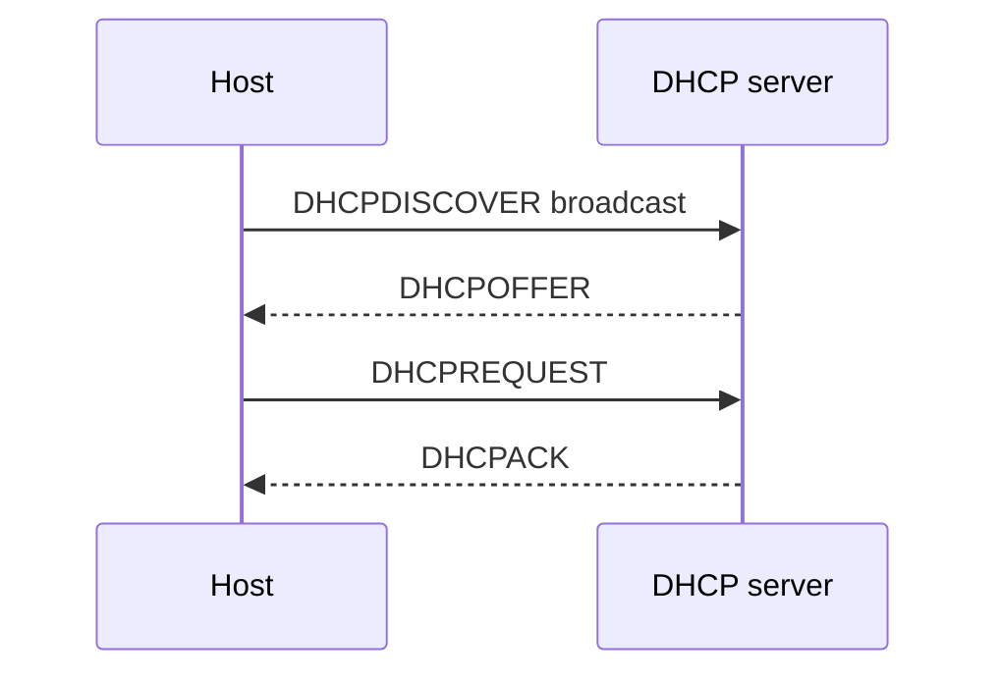

How to harden

- Enable DHCP snooping on access switches to block rogue servers.
- Combine snooping with Dynamic ARP Inspection to stop common spoofing tricks.
- Log every allocation and bind the log to change tickets for audits.

APIPA

- If a host cannot reach DHCP, it may self assign 169.254.x.x so it can at least talk on that link. Treat this as a clear signal to check cabling, VLANs, and IP helper addresses on the gateway.

---

## 10. TCP, UDP, ICMP and PMTUD

- What it is: Transport and control protocols that deliver bytes and report errors.
- Why it matters: Tuning or filtering here changes latency, throughput, and black‑hole behaviours.

TCP Transmission Control Protocol

- Reliable and ordered delivery. Three way handshake, retransmissions, congestion and flow control.
- Tuning you will actually touch listen backlog, `tcp_fin_timeout`, and socket buffer sizes under heavy churn.

UDP User Datagram Protocol

- Connectionless and message oriented. Good for DNS, telemetry, and as a substrate for QUIC.

ICMP Internet Control Message Protocol

- Carries error reporting and Path MTU Discovery PMTUD.
- If you block ICMP too broadly, PMTUD fails and large packets black hole. Permit the needed types on firewalls.

How to test quickly

- `ss -ti` to inspect TCP state. Look for retransmits and cwnd stalls.
- `tracepath` for PMTUD behaviour.
- `tcpdump -ni any -c 500 -w /tmp/trace.pcap` when you need proof.

---

## 11. Network topologies and Spanning Tree behaviour

- What it is: Common ways to connect hosts, switches, and routers.
- Why it matters: Topology choices determine failure domains, convergence, and whether STP is active or bored.

Star the classic office

- Access switches connect to a distribution pair. Simple to reason about.
- Dual uplinks from access to distribution are common. In pure Layer 2 designs, STP will block one path.

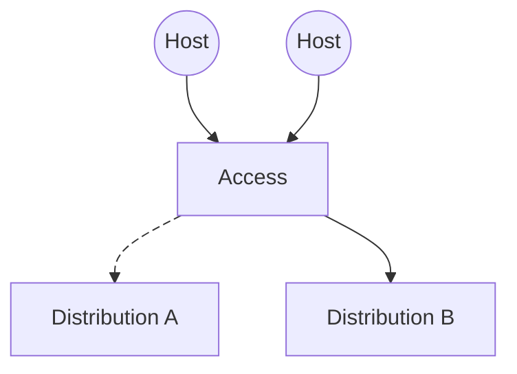

Leaf spine the data centre pattern

- Leaves connect to servers. Spines connect to leaves. No east west bottleneck and predictable hop count.
- Routing is normally Layer 3 everywhere with ECMP multipath. STP is effectively idle.

Hub and spoke WANs and cloud

- Spokes connect to a central hub such as AWS Transit Gateway.
- Simpler security, obvious traffic inspection points, and clear failure domains.

Overlays

- VXLAN EVPN for modern DC fabrics.
- GRE, IPSec or WireGuard for site to site and service meshes.

---

## 12. Ubuntu networking in 2025 setup

- What it is: Netplan generates systemd‑networkd (Server) or NetworkManager (Desktop) configs from YAML.
- Why it matters: Safe rollouts and clear YAML patterns prevent lockouts on remote systems.

Ubuntu Server uses Netplan which renders to systemd networkd by default. Desktop renders to NetworkManager. Use `sudo netplan try` before `sudo netplan apply` when remote so you can auto rollback.

DHCP on a NIC

```yaml
# /etc/netplan/01-dhcp.yaml
network:
  version: 2
  renderer: networkd
  ethernets:
    enp1s0:
      dhcp4: true
      dhcp6: true
```

Static dual stack with routes and DNS

```yaml
# /etc/netplan/02-static.yaml
network:
  version: 2
  renderer: networkd
  ethernets:
    enp1s0:
      addresses:
        - 198.51.100.10/24
        - 2001:db8:100:200::10/64
      routes:
        - to: 0.0.0.0/0
          via: 198.51.100.1
        - to: ::/0
          via: 2001:db8:100:200::1
      nameservers:
        addresses: [203.0.113.53, 2001:db8:53::1]
        search: [example.internal]
```

VLAN on a trunk

```yaml
# /etc/netplan/10-vlan.yaml
network:
  version: 2
  renderer: networkd
  ethernets:
    enp2s0: {}
  vlans:
    vlan100:
      id: 100
      link: enp2s0
      addresses: [192.0.2.10/24]
      routes:
        - to: 0.0.0.0/0
          via: 192.0.2.1
```

Bridge for KVM with a VLAN uplink

```yaml
# /etc/netplan/20-bridge.yaml
network:
  version: 2
  renderer: networkd
  ethernets:
    enp3s0: {}
  vlans:
    uplink.200:
      id: 200
      link: enp3s0
  bridges:
    br200:
      interfaces: [uplink.200]
      addresses: [203.0.113.10/27]
      parameters:
        stp: true
        forward-delay: 4
```

LACP bond for redundancy

```yaml
# /etc/netplan/30-bond.yaml
network:
  version: 2
  renderer: networkd
  ethernets:
    enp4s0: {}
    enp5s0: {}
  bonds:
    bond0:
      interfaces: [enp4s0, enp5s0]
      parameters:
        mode: 802.3ad
        mii-monitor-interval: 100
      addresses: [10.0.0.10/24]
      gateway4: 10.0.0.1
```

DNS on Ubuntu

- Use `resolvectl status` and `resolvectl query`.
- Confirm `/etc/resolv.conf` points at the systemd stub unless you manage it yourself.
- On Desktop, set `renderer: NetworkManager` if you want NetworkManager to own the interface.

---

## 13. Troubleshooting on Ubuntu in 2025

- What it is: A pragmatic flow from physical → IP → DNS → transport → packets.
- Why it matters: Quick, repeatable checks shorten incidents and avoid rabbit holes.

First minute triage that actually finds faults

1. Physical `ip -br link` and `dmesg | grep -i enp1s0`. If link is flapping, fix that first.
2. Addressing `ip -br addr` then `ip route` and `ip -6 route`. No default route means no internet.
3. DNS `resolvectl status` then `resolvectl query example.com`.
4. Connectivity `ping -c3 198.51.100.1`, then `tracepath 1.1.1.1` and `tracepath -6 2606:4700:4700::1111`.
5. Sockets `ss -tupn | head -n 30`. Find LISTEN and ESTABLISHED, look for SYN SENT.
6. Packets `sudo tcpdump -ni any not port 22 -c 400 -w /tmp/cap.pcap`.

Netplan safe workflow

- `sudo netplan generate` to validate.
- `sudo netplan try` to test with rollback.
- `sudo netplan apply` to commit.

When routing is weird

- `ip rule` and `ip route show table all`.
- Look for policy routing that sends replies out a different interface classic asymmetric path problems.

---

## 14. Troubleshooting with block diagrams

- What it is: A lightweight method to visualise the path and test each hop.
- Why it matters: It keeps you systematic under pressure and reveals where policy or NAT changes behaviour.

Draw only the necessary blocks between client and service. Test hop by hop. At each boundary, test both ways. Capture on ingress and egress to any policy device.

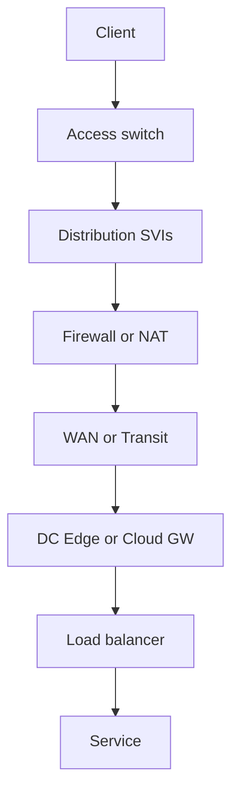

For each block

- Inputs and outputs
- Decision taken forward, drop, translate
- State tables to inspect MAC tables, ARP or neighbour caches, routes, NAT translations, ACL counters
- Proof packet capture on both sides

---

## 15. Routing protocols OSPF and BGP what, when, why, how

- What it is: Interior (OSPF) and exterior (BGP) routing protocols that compute paths and enforce policy.
- Why it matters: They decide reachability and failover. Clean policy prevents leaks and surprises at scale.

OSPF Open Shortest Path First

- What link state interior protocol. OSPFv2 for IPv4 and OSPFv3 for IPv6. Areas split large networks. Design for a contiguous backbone called area 0.
- When one administrative domain like a campus or data centre where you need fast convergence and equal cost multipath.
- Why every router knows the topology, so convergence is predictable. Summarise at Area Border Routers ABRs to limit churn.
- How point to point interfaces for clarity, consistent interface costs, and passive interfaces on user facing VLANs.

Minimal FRR example

```text
router ospf
 router-id 198.51.100.1
 passive-interface default
 no passive-interface enp1s0
 network 198.51.100.0/24 area 0
```

Minimal Cisco IOS example

```text
router ospf 10
 router-id 203.0.113.3
 network 10.10.10.0 0.0.0.255 area 0
```

BGP Border Gateway Protocol

- What path vector protocol. Uses attributes such as AS PATH, NEXT HOP, LOCAL PREF, MED, and communities to pick paths.
- When peering with ISPs, between organisations, or as a policy control plane internally. Essential for hybrid cloud and multi VPC.
- Why explicit policy. You decide what leaves and what enters. Scales globally.
- How strict route filters, `max-prefix` safeguards, and consistent community tagging. Use LOCAL PREF to steer egress within your AS. Use AS PATH prepending as a last resort to influence inbound when you cannot set neighbour policy.

Minimal FRR eBGP example

```text
router bgp 65010
 bgp router-id 203.0.113.10
 neighbor 198.51.100.254 remote-as 64512
 !
 address-family ipv4 unicast
  network 203.0.113.0/24
  neighbor 198.51.100.254 activate
 exit-address-family
 !
 address-family ipv6 unicast
  network 2001:db8:100::/48
  neighbor 2001:db8:ffff::254 remote-as 64512
  neighbor 2001:db8:ffff::254 activate
 exit-address-family
```

What to log and alert

- OSPF adjacency changes and LSA floods out of cycle.
- BGP session flaps, changes in advertised prefixes, and max prefix alarms.
- Keep a plain text policy document with example routes and intended attributes so you can verify with `show ip bgp` or `vtysh -c "show bgp ..."`.

---

## 16. Cisco campus design why it still matters

- What it is: A hierarchical Access → Distribution → Core model, often with routed access.
- Why it matters: Predictable failure domains, simple summaries, and fewer STP headaches.

The classic hierarchical model is Access, Distribution, Core. The reasons it persists

- Predictable fault domains and blast radii.
- Modularity and clear summaries at each tier.
- Easy to adopt routed access Layer 3 from access to distribution so that Spanning Tree has very little to do.

Useful refinements in 2025

- Virtual chassis or StackWise at access for simplified management.
- MLAG or virtual switching at distribution so an access switch can dual home without blocked ports.
- Summarise at distribution. Keep area 0 at distribution if you use OSPF.
- Place Layer 3 close to the edge to keep broadcast domains small.

---

## 17. Networking in AWS what you must know

- What it is: VPC primitives for routing, security, and hybrid connectivity.
- Why it matters: Costs and defaults can bite; the right constructs simplify connectivity and governance.

VPC Virtual Private Cloud

- Plan non overlapping CIDRs with on prem. Decide early if you want IPv6.
- Subnets are Availability Zone scoped. Route tables attach to subnets.
- Internet Gateway IGW provides public internet access for public subnets.
- NAT Gateway NGW provides outbound internet for private subnets. It charges per hour and per gigabyte.
- VPC endpoints
  - Gateway endpoints S3 and DynamoDB route at the route table.
  - Interface endpoints PrivateLink give you private access to AWS services and third parties without routing full CIDRs.

Security

- Security Groups are stateful and attach to ENIs elastic network interfaces.
- Network ACLs are stateless and attach to subnets. Use them sparingly.
- VPC Flow Logs help you see accepted and rejected traffic.

Hybrid and multi VPC

- Transit Gateway TGW is a regional hub for many VPCs and on prem. Use TGW instead of complex peering meshes.
- VPC peering is simple and non transitive. Good for small numbers of VPCs.
- PrivateLink is ideal when you produce or consume a single application privately.

IPv6 in AWS

- Assign an IPv6 block to the VPC. Give each subnet a /64.
- Use an egress only internet gateway for IPv6 outbound from private subnets.
- Many services including load balancers and EKS support dual stack.

A small dual stack VPC at a glance

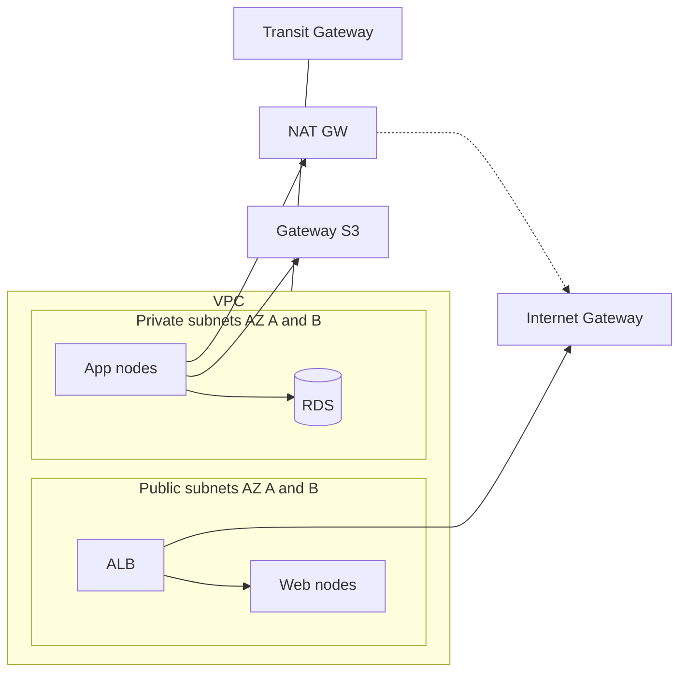

Cost traps you will actually hit

- NAT data processing adds up if your apps pull or push to S3. Use S3 Gateway Endpoints.
- Interface endpoints charge per hour and per gigabyte. Prefer Gateway endpoints when possible.
- Cross AZ data has a cost. This matters for chatty microservices.

---

## 18. Real‑world scenarios and playbooks

- What it is: Brief, concrete incidents you will encounter, with detection and fixes.
- Why it matters: Having a mental model and a few commands ready cuts MTTR.

Campus access loop via unmanaged switch

- Symptom: MAC flapping between two access ports, broadcast counters racing, DHCP timeouts.
- Detect: `show mac address-table | include Flap` (vendor‑specific), interface broadcast/multicast counters, syslog BPDU messages.
- Fix: Enable `spanning-tree portfast`, `spanning-tree bpduguard enable`, and storm control on edge ports. Educate users: “no mini‑switches”.

Server dual‑home without LACP

- Symptom: Intermittent packet loss under load; one of two links inconsistently forwards. ARP entries alternate.
- Detect: `show etherchannel summary` or LACP partner state; on Linux, check `teamdctl`/`cat /proc/net/bonding/bond0`.
- Fix: Use LACP active/passive on both sides; or use routing with two independent links and ECMP.

Native VLAN mismatch on trunks

- Symptom: Cross‑VLAN leakage of broadcasts/ARP; security alarms about unexpected MAC in VLAN.
- Detect: Compare trunk native VLAN and allowed VLANs on both sides. Capture shows untagged frames where tags expected.
- Fix: Standardise native VLAN (prefer none/unused) and explicitly tag all VLANs on trunks.

HTTP/3 fallback and firewall surprises

- Symptom: Some clients slower; QUIC handshake fails, silently falls back to HTTP/2.
- Detect: `curl -v --http3` vs `--http2`; capture shows blocked UDP/443.
- Fix: Permit UDP/443 on edge; if not possible, tune HTTP/2 settings and TCP.

Leaf‑spine L2 vs MLAG

- Symptom: STP blocking on one of two uplinks from an access switch; only one uplink forwards.
- Option A RSTP: Accept one blocked port; small broadcast domain; fast failover.
- Option B MLAG/VPC: Active/active uplinks without STP blocking; requires vendor pair and ISC/peer link.

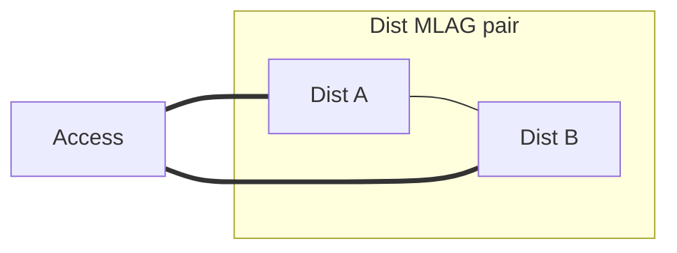

Useful neutral references

- Link aggregation: https://en.wikipedia.org/wiki/Link_aggregation
- MC‑LAG concept: https://en.wikipedia.org/wiki/Multi-chassis_link_aggregation
- VLANs: https://en.wikipedia.org/wiki/Virtual_LAN
- Amazon VPC overview: https://docs.aws.amazon.com/vpc/latest/userguide/what-is-amazon-vpc.html

---

## 19. NAT and Port Forwarding

- What it is: NAT translates addresses/ports between private and public spaces. Port forwarding (DNAT) exposes an internal service inbound.
- Why it matters: Nearly every edge and lab uses PAT/NAPT; debugging NAT state and hairpins is common.

Concepts you’ll use

- SNAT/masquerade: many internal to one external (outbound internet).
- DNAT/port forward: map `WAN:port` to `LAN:host:port` (inbound access).
- Hairpin NAT: client inside reaches the public IP of its own service; requires NAT reflection.

Visual: simple port forward

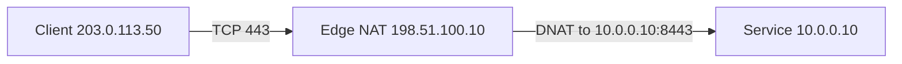

Linux `nftables` example (IPv4)

```bash
sudo nft add table ip nat
sudo nft add chain ip nat prerouting { type nat hook prerouting priority -100; }
sudo nft add chain ip nat postrouting { type nat hook postrouting priority 100; }

# DNAT WAN:443 -> 10.0.0.10:8443
sudo nft add rule ip nat prerouting iifname "eth0" tcp dport 443 dnat to 10.0.0.10:8443

# SNAT LAN -> internet via WAN address
sudo nft add rule ip nat postrouting oifname "eth0" masquerade
```

Common pitfalls

- Forwarded but not reachable: missing firewall allow on WAN interface, or service bound only to localhost.
- Hairpin fails: add reflection DNAT/SNAT or use split‑horizon DNS.
- Overlays (WireGuard/Tailscale) and NAT: MTU and keepalive settings matter; some NATs time out UDP quickly.

---

## 20. SSH Tunneling and Port Forwarding

- What it is: Encrypted tunnels for ad‑hoc access. Local/remote/dynamic forwards map ports across hosts.
- Why it matters: Staple for bastion access, reaching private DBs, or quick SOCKS proxies.

Modes you’ll actually use

- Local forward `-L LPORT:HOST:PORT`: expose remote service locally.
- Remote forward `-R RPORT:HOST:PORT`: expose your local service on the remote.
- Dynamic `-D LPORT`: local SOCKS5 proxy; apps route via SSH.

Examples

```bash
# Reach a private DB via bastion
ssh -J user@bastion corp@db-host -L 5432:127.0.0.1:5432
psql -h 127.0.0.1 -p 5432

# Expose local dev server to a bastion (careful with GatewayPorts)
ssh user@bastion -R 8080:127.0.0.1:3000

# Ad-hoc SOCKS proxy for a single command
ssh -N -D 1080 user@bastion &
ALL_PROXY=socks5h://127.0.0.1:1080 curl https://ifconfig.me
```

Hardening and ops

- Use `ProxyJump` in `~/.ssh/config`; restrict with `PermitOpen` and `GatewayPorts no`.
- Prefer key + FIDO2. Use `ssh -o ServerAliveInterval=30` through flaky NATs.

---

## 21. HTTP/S Streaming and Reverse Proxying

- What it is: HTTP streaming (chunked, H2 streams), WebSockets, and reverse proxies terminate TLS and fan‑out to backends.
- Why it matters: Idle timeouts, buffering, and proxy headers affect real‑time systems and media.

Patterns

- Reverse proxy: edge terminates TLS and forwards to service; add `X-Forwarded-For`/`Forwarded`.
- Forward proxy: clients egress via proxy (security, egress control).
- Long‑lived connections: H2 streams, WS, gRPC—watch proxy idle timeouts.

Nginx reverse proxy (WebSockets and H2)

```nginx
server {
  listen 443 ssl http2;
  server_name app.example.com;
  ssl_certificate ...; ssl_certificate_key ...;
  location / {
    proxy_pass http://10.0.0.20:8080;
    proxy_set_header Host $host;
    proxy_set_header X-Forwarded-For $proxy_add_x_forwarded_for;
    proxy_set_header X-Forwarded-Proto $scheme;
    proxy_http_version 1.1; proxy_set_header Upgrade $http_upgrade; proxy_set_header Connection "upgrade";
    proxy_read_timeout 3600s;
  }
}
```

Troubleshooting

- Compare `curl -N`, `--http2`, `--http3`. Check LB idle timeouts and buffer sizes. Baseline with `tcpdump` at edge and backend.

---

## 22. DHCP Advanced: Reservations, Snooping, Helpers

- What it is: DHCP at scale with predictable addressing and security features.
- Why it matters: Reservations make ops predictable; snooping + port security stop rogue DHCP.

Reservations and options

- Bind MAC → IP on server; use for infra nodes and printers.
- Options you’ll use: 3 router, 6 DNS, 15 domain, 42 NTP, 66/67 PXE, 121/249 classless static routes.
- Option 82 (relay info): carries switch/port to the DHCP server.

Relays and HA

- On the SVI, set helpers to DHCP servers. Use two for HA.
- Cisco: `ip helper-address 10.0.0.5` on VLAN SVI.

Security at the edge

```text
ip dhcp snooping
ip dhcp snooping vlan 10,20
interface Gi1/0/10
 switchport mode access
 ip dhcp snooping limit rate 30
 ip verify source vlan dhcp-snooping port-security
 switchport port-security maximum 2
 switchport port-security mac-address sticky
 switchport port-security violation restrict
```

---

## 23. IP Range Strategies and Default Routes

- What it is: Hierarchical addressing and sane defaults that summarise cleanly.
- Why it matters: Easier routing, fewer ACLs, simpler incident scopes.

Strategies

- Reserve per‑site blocks (e.g., `/20` per site), slice predictable `/24` per VLAN. Keep management and user subnets separate.
- IPv6: allocate `/48` per site; hand `/64` per LAN. Use ULA for internal‑only.
- Summarise at distribution; align VLAN numbers with third octet when possible.

Default routes

```bash
# Linux
ip route add default via 10.0.0.1
ip -6 route add default via 2001:db8:1::1

# FRR static with tracked next-hop
ip route 0.0.0.0/0 203.0.113.1
ipv6 route ::/0 2001:db8:ffff::1
```

Visual


---

## 24. Firewalls: Quick Patterns

- What it is: Host and network firewalls applying stateful policy; often combined with NAT.
- Why it matters: Clear allow‑lists and minimal exposure reduce blast radius.

Linux `nftables` minimal

```bash
sudo nft add table inet filter
sudo nft add chain inet filter input { type filter hook input priority 0; policy drop; }
sudo nft add rule inet filter input ct state established,related accept
sudo nft add rule inet filter input iif lo accept
sudo nft add rule inet filter input tcp dport {22,80,443} accept
```

`ufw` quick

```bash
sudo ufw default deny incoming
sudo ufw allow 22/tcp
sudo ufw allow 443/tcp
sudo ufw enable
```

Cloud note: Security Groups are stateful per‑ENI; NACLs are stateless per subnet—use sparingly.

---

## 25. VPNs: OpenVPN, WireGuard, Tailscale, ZeroTier

- What it is: Encrypted overlays for site‑to‑site, user‑to‑site, or mesh.
- Why it matters: Hybrid access, secure admin paths, and multi‑cloud linking.

WireGuard quick site‑to‑site

```ini
# /etc/wireguard/wg0.conf (site A)
[Interface]
Address = 10.200.0.1/24
ListenPort = 51820
PrivateKey = <A-priv>

[Peer]
PublicKey = <B-pub>
AllowedIPs = 10.200.0.0/24
Endpoint = b.example.net:51820
PersistentKeepalive = 25
```

OpenVPN notes

- TLS‑based; flexible L3/L2; more knobs, more overhead. Good for legacy and mixed clients.

Overlays (Tailscale/ZeroTier)

- Managed control plane builds WireGuard/virtual links; easy mesh. Great for teams and labs.
- Be aware of relay (DERP) vs direct and ACL models. Consider egress routing and DNS integration.

Visual

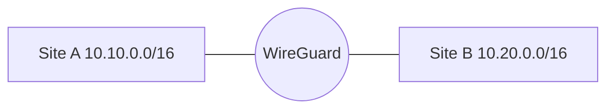

---

## 26. ISPs, GPON, and the Internet

- What it is: Access technologies and how your edge meets the internet.
- Why it matters: MTU, CGNAT, and PPPoE shape reliability and port forwarding.

GPON quick

- ONT at premises, OLT at exchange. ISPs may deliver via PPPoE or DHCP; VLAN tags common. PPPoE reduces MTU to ~1492—tune MSS.
- Some ISPs use CGNAT; inbound port forwards won’t work—use reverse tunnels or VPN/overlays.

Edge patterns

- Bridge ISP CPE and run your own router/firewall. Prefer public static IPs when hosting.
- Peering vs transit: enterprises normally buy transit from ISPs; peering is for networks exchanging traffic as equals.

---

## 27. Emulation: GNS3

- What it is: A flexible, open lab platform using QEMU and real network software images.
- Why it matters: Lets you build modern topologies (Linux, FRR, VyOS, cEOS/cSR) and integrate with your host network.

Notes

- We standardize on GNS3 for the labs in this repo to keep things consistent.
- Consider Containerlab/Netlab for declarative topologies when you’re comfortable.
- Tip: Keep lab configs under version control; add a simple topology diagram and README in each lab folder.

Optional alternative

- A simple Packet Tracer campus lab is included as an optional alternative for quick experimentation: `networking-labs/packet-tracer-campus/README.md`.

---

## 28. Hands‑On Lab: NAT + DHCP + STP (GNS3)

- What it is: A reproducible mini‑campus with NAT to the internet, DHCP for clients, and STP protecting L2.
- Why it matters: You can safely practice port forwards, hairpin, DHCP options, and loop mitigation.

Topology

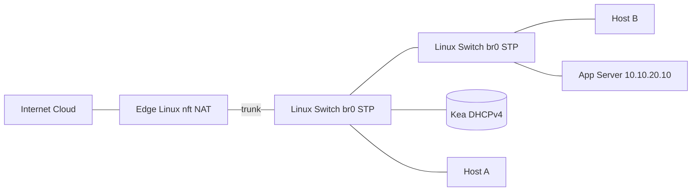

Addressing

- WAN: `EDGE eth0` DHCP or `198.51.100.10/24` (example)
- LAN trunk: `EDGE eth1` with VLANs 10 (clients) and 20 (servers)
- VLAN10: `10.10.10.0/24` gateway `10.10.10.1`
- VLAN20: `10.10.20.0/24` gateway `10.10.20.1`

Edge Linux (routing + NAT + DNAT + hairpin)

```bash
# Subinterfaces for VLANs
sudo ip link add link eth1 name eth1.10 type vlan id 10
sudo ip link add link eth1 name eth1.20 type vlan id 20
sudo ip addr add 10.10.10.1/24 dev eth1.10
sudo ip addr add 10.10.20.1/24 dev eth1.20
sudo ip link set eth1.10 up; sudo ip link set eth1.20 up
sudo sysctl -w net.ipv4.ip_forward=1

# nftables
sudo nft -f - <<'EOF'
table ip nat {
  chain prerouting { type nat hook prerouting priority -100; }
  chain postrouting { type nat hook postrouting priority 100; }
}

# Outbound SNAT (masquerade) via WAN eth0
add rule ip nat postrouting oifname "eth0" masquerade

# Inbound DNAT: WAN:443 -> 10.10.20.10:443
add rule ip nat prerouting iifname "eth0" tcp dport 443 dnat to 10.10.20.10:443

# Hairpin: LAN clients reaching our own WAN IP on 443
# Replace 198.51.100.10 with your real WAN address
add rule ip nat prerouting iifname { "eth1.10", "eth1.20" } ip daddr 198.51.100.10 tcp dport 443 dnat to 10.10.20.10:443

# Hairpin SNAT back to gateway's LAN IP so replies return via EDGE
add rule ip nat postrouting oifname { "eth1.10", "eth1.20" } ip saddr 10.10.0.0/16 ip daddr 10.10.20.10 masquerade
EOF
```

Linux Switch nodes (enable STP)

```bash
sudo ip link add br0 type bridge
sudo ip link set br0 up
sudo ip link set dev br0 type bridge stp_state 1
# Add attached ports to br0; repeat per switch
sudo ip link set eth1 master br0
sudo ip link set eth2 master br0
sudo ip link set eth3 master br0
```

Kea DHCPv4 server (VLAN10)

```json
{
  "Dhcp4": {
    "interfaces-config": { "interfaces": ["eth0"] },
    "subnet4": [
      {
        "subnet": "10.10.10.0/24",
        "pools": [{ "pool": "10.10.10.50 - 10.10.10.199" }],
        "option-data": [
          { "name": "routers", "data": "10.10.10.1" },
          { "name": "domain-name-servers", "data": "10.10.20.10,1.1.1.1" },
          { "name": "domain-name", "data": "lab.example" }
        ],
        "reservations": [
          {
            "hw-address": "00:11:22:33:44:55",
            "ip-address": "10.10.10.10",
            "hostname": "printer-1"
          }
        ]
      }
    ]
  }
}
```

Exercises

- Verify DHCP lease on H1/H2 and default route to `10.10.10.1`.
- Create a loop between SW1 and SW2; watch storm; enable STP and see the block.
- From internet side, hit `https://WAN_IP/` and reach SVC via DNAT.
- From H1, curl `https://WAN_IP/` to confirm hairpin works.

---

## 29. VPN Decision Guide

- WireGuard: very fast, simple config, UDP only, small code base. Best for site‑to‑site, SRE tunnels, containers. Needs external tooling for dynamic peers/ACL.
- OpenVPN: very flexible (TCP/UDP, TLS auth, L2/L3), broad client support. Slower and heavier. Good for legacy, mixed platforms, or when TLS features matter.
- Tailscale: managed WireGuard mesh with easy NAT traversal, identity/ACLs, DNS, exit nodes. Great for teams/admin/dev. Consider headscale if you need self‑hosted control plane.
- ZeroTier: easy L2/L3 overlay with central controller, good NAT traversal. Useful for ad‑hoc L2 networks and small teams.

Quick picks

- Site‑to‑site with infra control: WireGuard (FRR + wg, or VyOS).
- Remote users with SSO and device posture: Tailscale.
- Legacy L2 bridging or stringent TLS: OpenVPN.
- Simple L2 overlay across NAT: ZeroTier.

---

## 30. Kea DHCP and Hairpin NAT Details

Kea service notes

- Package: `kea-dhcp4-server` (Debian/Ubuntu). Service file `kea-dhcp4.service`. Config at `/etc/kea/kea-dhcp4.conf`.
- Enable relay info (Option 82) parsing if using DHCP snooping/relay.

Hairpin NAT patterns (Linux nftables)

```bash
WAN_IP=198.51.100.10
LAN_NET=10.10.0.0/16
SVC_IP=10.10.20.10

# 1) DNAT inside the LAN when clients target WAN_IP
sudo nft add rule ip nat prerouting iifname { "eth1.10", "eth1.20" } ip daddr $WAN_IP tcp dport 443 dnat to $SVC_IP:443

# 2) Ensure return path stays via the gateway by masquerading
sudo nft add rule ip nat postrouting oifname { "eth1.10", "eth1.20" } ip saddr $LAN_NET ip daddr $SVC_IP masquerade
```

Verification

- From a LAN host, curl `https://$WAN_IP/` and ensure the server logs the client LAN IP or the gateway IP depending on SNAT; set `proxy_protocol`/`X-Forwarded-For` appropriately at the reverse proxy.

---

## 31. Labs and Walkthroughs

- GNS3 NAT + DHCP + STP lab: `networking-labs/gns3-nat-dhcp-stp/README.md`
  - Includes edge `nftables` NAT + DNAT + hairpin script and Kea config.
  - Walkthrough: build topology, verify DHCP, test hairpin, trigger and fix an STP loop.
  - Template: `networking-labs/gns3-nat-dhcp-stp/project.gns3project.template`

- GNS3 Core + OSPF + DHCP lab: `networking-labs/gns3-core-ospf-dhcp/README.md`
  - Core router/gateway with internet access, core/distribution/edge layers, OSPF, central DHCP with relays.
  - Walkthrough: bring up OSPF, verify routes and failover, validate DHCP relay per VLAN.
  - Template: `networking-labs/gns3-core-ospf-dhcp/project.gns3project.template`

Quick start guide

- See `docs/networking-labs-quickstart.md` for a suggested learning path and tips.

Optional alternative

- Packet Tracer Campus (simple): `networking-labs/packet-tracer-campus/README.md`
  - Edge NAT + DHCP pools, Rapid-PVST root/secondary, PortFast/BPDU Guard, storm-control, and port-security.

Real‑world use cases tied to labs

- Small branch with public ISP: NAT overload + DNAT for a small on‑prem app; hairpin to support a shared FQDN internally.
- Campus loop event: unmanaged switch on a desk creates a loop; BPDU Guard shuts the port and logs; operations notify the user.
- Developer remote access: SSH `-L` to a private DB via bastion; WireGuard site‑to‑site for CI runners hitting on‑prem registries.

## Sources and credibility

Primary references you can cite in reviews

- RFC 791 IPv4. RFC 4632 CIDR. RFC 1918 private IPv4.
- RFC 826 ARP. RFC 4861 IPv6 Neighbour Discovery. RFC 8200 IPv6.
- RFC 2131 DHCPv4. RFC 3927 IPv4 link local APIPA.
- RFC 768 UDP. RFC 792 ICMP. RFC 4443 ICMPv6. RFC 1191 and RFC 8201 PMTUD.
- HTTP RFC 9110 semantics, RFC 9112 HTTP/1.1, RFC 9114 HTTP/3.
- IEEE 802.1Q VLAN tagging. IEEE 802.1D STP with RSTP 802.1w and MSTP 802.1s.
- IEEE 802.3 Ethernet including PoE amendments.
- FRRouting user guides for OSPF and BGP configuration.
- Cisco campus design guides for hierarchical and routed access models.
- AWS official documentation for VPC, NAT Gateway, Transit Gateway, and PrivateLink.
- Canonical Netplan and systemd resolved documentation.
- OpenSSH manual pages for forwarding: `man ssh`, `man ssh_config` (ProxyJump, LocalForward, RemoteForward).
- nftables quickstart and wiki: https://wiki.nftables.org/
- NGINX reverse proxy docs and WebSocket proxying.
- DHCP snooping and option 82 vendor guides; ISC Kea/ISC DHCP documentation.
- WireGuard documentation: https://www.wireguard.com/ and `man wg-quick`.
- OpenVPN community docs: https://openvpn.net/community-resources/how-to/
- Tailscale docs: https://tailscale.com/kb/ and ZeroTier docs: https://docs.zerotier.com/
- GPON overview: https://en.wikipedia.org/wiki/Gigabit-capable_Passive_Optical_Network
- Peering/transit background: https://en.wikipedia.org/wiki/Peering and https://www.peeringdb.com/
- GNS3 docs: https://docs.gns3.com/ (we standardize on GNS3 in this repo).

---

## Final checklist and quick grabs

- Use OSI words to scope the fault. Configure with TCP/IP thinking.
- For HTTP incidents, confirm the negotiated version and test alternates.
- Keep Layer 2 domains small. Push Layer 3 to the access to render STP boring.
- Memorise private ranges and the /31 and /32 special cases.
- Use Netplan try on remote Ubuntu changes.
- In AWS, kill NAT hairpins with Gateway Endpoints and PrivateLink.
