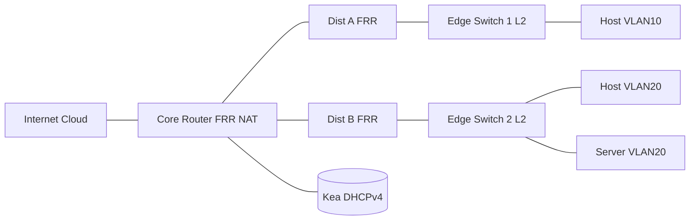

GNS3 Lab: Core + OSPF + DHCP (Hierarchical Campus)

Overview

- Build a core/distribution/edge topology with OSPF for routing, central DHCP with relays, and internet access via the core.
- Nodes (example images): Linux + FRR for routing, Linux bridges for L2 edge, Kea DHCP server, an Internet cloud node.

What, Why, When, How

- What: A hierarchical campus with a core internet gateway, dynamic routing via OSPF between core and distribution, L2 edges, and centralised DHCP with relays.
- Why: Demonstrates scalable patterns you’ll meet in real networks: summarised boundaries, fast convergence, and centralised services.
- When: Use when a site grows beyond a flat L2 and needs predictable failover and clear fault domains.
- How: FRR runs OSPF on transit links and SVIs; core originates a default and performs NAT; distribution advertises connected VLANs and relays DHCP.

Topology



Addressing (example)

- WAN (CORE `eth0`): DHCP from Internet or `198.51.100.10/24`
- CORE–D1 transit: `10.0.1.0/30` (CORE `.1`, D1 `.2`)
- CORE–D2 transit: `10.0.2.0/30` (CORE `.1`, D2 `.2`)
- VLAN10 (on D1 and D2 SVIs): `10.10.10.0/24` gateway `.1` on each dist (HSRP/VRRP optional)
- VLAN20 (on D1 and D2 SVIs): `10.10.20.0/24` gateway `.1` on each dist

Plan

1. CORE runs FRR OSPF and default route to internet; redistributes default to the dists; does NAT for egress.
2. D1/D2 run FRR OSPF on uplinks and SVIs; advertise connected VLAN interfaces.
3. Edge switches are L2 only; user/server ports are access in VLAN10/20; uplinks to dists are trunks.
4. Kea serves both VLANs; D1/D2 run DHCP relays on SVIs pointing to CORE’s Kea IP.

FRR configs (snippets)

CORE (FRR)

```text
!
router ospf
 router-id 203.0.113.1
 network 10.0.1.0/30 area 0
 network 10.0.2.0/30 area 0
 default-information originate always
!
```

Add Linux defaults and NAT on CORE (nftables)

```bash
sudo ip route replace default via 198.51.100.1 dev eth0
sudo sysctl -w net.ipv4.ip_forward=1
sudo nft -f - <<'EOF'
flush ruleset
table ip nat {
  chain postrouting { type nat hook postrouting priority 100; }
}
EOF
sudo nft add rule ip nat postrouting oifname "eth0" masquerade
```

D1 (FRR)

```text
!
interface vlan10
 ip address 10.10.10.1/24
!
interface vlan20
 ip address 10.10.20.1/24
!
router ospf
 router-id 203.0.113.2
 network 10.0.1.0/30 area 0
 network 10.10.10.0/24 area 0
 network 10.10.20.0/24 area 0
 passive-interface vlan10
 passive-interface vlan20
!
```

D2 (FRR) mirrors D1 with the `10.0.2.0/30` uplink and same VLANs.

DHCP relay on D1/D2 (ISC dhcrelay)

```bash
sudo apt-get install -y isc-dhcp-relay
sudo sed -i 's/^SERVERS=.*/SERVERS="10.0.1.1"/' /etc/default/isc-dhcp-relay
sudo sed -i 's/^INTERFACES=.*/INTERFACES="vlan10 vlan20"/' /etc/default/isc-dhcp-relay
sudo systemctl enable --now isc-dhcp-relay
```

Kea DHCP on CORE (two VLANs)

```json
{
  "Dhcp4": {
    "interfaces-config": { "interfaces": ["lo"] },
    "subnet4": [
      {
        "subnet": "10.10.10.0/24",
        "pools": [{ "pool": "10.10.10.50 - 10.10.10.199" }],
        "option-data": [
          { "name": "routers", "data": "10.10.10.1" },
          { "name": "domain-name-servers", "data": "1.1.1.1" }
        ]
      },
      {
        "subnet": "10.10.20.0/24",
        "pools": [{ "pool": "10.10.20.50 - 10.10.20.199" }],
        "option-data": [
          { "name": "routers", "data": "10.10.20.1" },
          { "name": "domain-name-servers", "data": "1.1.1.1" }
        ]
      }
    ]
  }
}
```

Edge switches (Linux bridges)

```bash
sudo ip link add br0 type bridge
sudo ip link set br0 up
sudo ip link set dev br0 type bridge stp_state 1
sudo ip link set uplink master br0
sudo ip link set host1 master br0
sudo ip link set host2 master br0
```

Walkthrough

1. Bring up CORE uplinks to D1/D2, set OSPF on all routers; verify neighbors with `vtysh -c "show ip ospf neighbor"`.
2. Confirm routes: hosts in VLAN10/20 can reach the internet via CORE (NAT). Check `tracepath` from a host.
3. Start Kea on CORE and dhcrelay on D1/D2; verify clients obtain leases with the correct default gateway.
4. Fail an uplink (CORE–D1); ensure traffic still flows via CORE–D2 (OSPF converges). Observe route table changes.

Verification commands

- `vtysh -c "show ip route"`, `show ip ospf neighbor`, `show ip ospf database`
- `resolvectl status`, `ip -br addr`, `ip route` on hosts
- `tcpdump -ni any port 67 or 68` on D1/D2 to see relayed DHCP

Configs

- FRR configs:
  - Core: `networking-labs/gns3-core-ospf-dhcp/frr/core/frr.conf`
  - Dist A: `networking-labs/gns3-core-ospf-dhcp/frr/dist-a/frr.conf`
  - Dist B: `networking-labs/gns3-core-ospf-dhcp/frr/dist-b/frr.conf`
  - Daemons: `networking-labs/gns3-core-ospf-dhcp/frr/daemons` (enable `zebra` and `ospfd`)

Apply on Debian/Ubuntu nodes

```bash
sudo apt-get update && sudo apt-get install -y frr frr-pythontools
sudo cp networking-labs/gns3-core-ospf-dhcp/frr/daemons /etc/frr/daemons
sudo cp networking-labs/gns3-core-ospf-dhcp/frr/<node>/frr.conf /etc/frr/frr.conf
sudo chown frr:frr /etc/frr/frr.conf
sudo systemctl enable --now frr
```

Interface IPs

- Set interface IPs with `ip addr add` on Linux; FRR learns connected networks. Example on D1:

```bash
sudo ip link add link uplink name vlan10 type vlan id 10
sudo ip link add link uplink name vlan20 type vlan id 20
sudo ip addr add 10.10.10.1/24 dev vlan10
sudo ip addr add 10.10.20.1/24 dev vlan20
sudo ip addr add 10.0.1.2/30 dev uplink
sudo ip link set vlan10 up; sudo ip link set vlan20 up; sudo ip link set uplink up
```

Project template and notes

- Nodes: `core`, `dist-a`, `dist-b`, `edge-1` (bridge), `edge-2` (bridge), `dhcp`, `internet`.
- Interface mapping (example):
  - `core`: `eth0`→internet, `eth1`→D1 (10.0.1.1/30), `eth2`→D2 (10.0.2.1/30)
  - `dist-a`: `uplink`→core (10.0.1.2/30), `vlan10`/`vlan20` SVIs, `downlinks`→edge-1
  - `dist-b`: `uplink`→core (10.0.2.2/30), `vlan10`/`vlan20` SVIs, `downlinks`→edge-2
  - `dhcp`: single link to core
  - `edge-*`: Linux bridge with STP on; host ports as access
- Minimal GNS3 template: `project.gns3project.template` (replace template names and UUIDs)

Real‑world use

- Mirrors a small campus or regional site: hierarchical design, single internet edge, dynamic IGP, central DHCP with relay.

Examples & real‑world use cases

- Dual uplink resilience: drop CORE–D1; OSPF converges to CORE–D2; hosts retain internet access with minimal downtime.
- Central DHCP with relays: operations retain control and audit of address assignments; relays carry interface information for scoping.
- Gradual L3 at the edge: move SVIs from distribution to access over time; OSPF adjacency patterns remain consistent.

Learning outcomes

- Explain the benefits of hierarchical design and OSPF area 0 adjacency.
- Configure FRR for OSPF on transit and SVI interfaces; verify neighbors and LSDB.
- Implement DHCP relay and centralised Kea DHCP serving multiple VLANs.
- Validate failover paths and default route origination at the core.

Extras

- Scripts to set interfaces quickly:
  - `networking-labs/gns3-core-ospf-dhcp/scripts/core-interfaces.sh`
  - `networking-labs/gns3-core-ospf-dhcp/scripts/dist-a-interfaces.sh`
  - `networking-labs/gns3-core-ospf-dhcp/scripts/dist-b-interfaces.sh`
- Mapping and project tips:
  - `networking-labs/gns3-core-ospf-dhcp/node-mapping.example.yaml`
  - `networking-labs/gns3-core-ospf-dhcp/project-notes.md`

Quick verify scripts

- `scripts/verify-core.sh`: checks OSPF neighbors, routes, NAT table, default route.
- `scripts/verify-dist.sh`: checks OSPF neighbors, VLAN SVIs, watches DHCP relay traffic.
- `scripts/verify-host.sh`: checks addressing, gateway reachability, and path to internet.

Persisting config (optional)

- Use `networking-labs/common/systemd/` examples to persist NAT rules and ensure FRR starts on boot.
