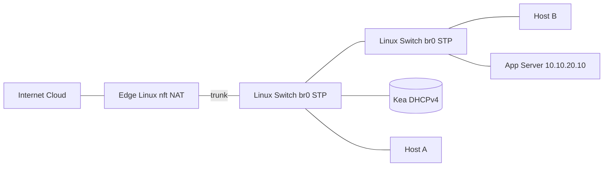

GNS3 Lab: NAT + DHCP + STP

Overview

- Build a safe mini-campus to practice NAT, DNAT/port-forward, hairpin NAT, DHCP reservations, and STP loop mitigation.
- Nodes: Edge Linux router, two Linux bridge switches, Kea DHCP server, App server, two clients, and an Internet cloud.

Topology



What, Why, When, How

- What: A small branch network with user and server VLANs behind a Linux edge, featuring SNAT (egress), DNAT/port‑forward (ingress), hairpin NAT, a DHCP server, and STP loop protection.
- Why: Mirrors common small‑site realities and the most frequent troubleshooting patterns (NAT state, hairpin, DHCP reachability, L2 loops).
- When: Use for quick refreshers, demos, or to prove out hairpin vs split‑DNS tradeoffs and loop containment strategies.
- How: Edge runs `nftables` NAT/DNAT; Kea serves addresses; Linux bridges emulate access switches with STP enabled.

Addressing

- WAN (EDGE `eth0`): DHCP from Internet cloud or static 198.51.100.10/24
- LAN trunk (EDGE `eth1`): VLAN10 clients `10.10.10.0/24` (gw `.1`), VLAN20 servers `10.10.20.0/24` (gw `.1`)

Files

- `edge-linux-nftables.sh`: brings up VLANs and installs `nftables` NAT + DNAT + hairpin rules.
- `kea-dhcp4.json`: sample Kea config for VLAN10 pool, DNS, and a reservation.
- `scripts/verify-edge.sh` and `scripts/verify-client.sh`: quick verification scripts to run on edge and clients.
- `node-mapping.example.yaml`: interface/name mapping template for your GNS3 nodes.
- `project.gns3project.template`: minimal GNS3 project JSON; replace template names and UUIDs.

Steps

1. Place nodes and connect links as per diagram. Attach EDGE `eth1` to both SWs (through one SW is fine), app and DHCP to access ports.
2. On Edge: copy and run `edge-linux-nftables.sh` (edit WAN IP if static). Enable IP forwarding persists via sysctl if needed.
3. On Kea VM: place `kea-dhcp4.json` to `/etc/kea/kea-dhcp4.conf`, start `kea-dhcp4.service` and bind to the VLAN10 interface.
4. On SW1 and SW2: create `br0`, add member interfaces, enable STP (see below). Alternatively, use Open vSwitch with RSTP.
5. Clients H1/H2: obtain DHCP; verify default route to `10.10.10.1`.
6. App server SVC: bind HTTPS on `10.10.20.10:443`.
7. From Internet side: `curl -vk https://<WAN_IP>/` and reach SVC (DNAT).
8. From H1: `curl -vk https://<WAN_IP>/` to confirm hairpin NAT works.
9. Loop test: temporarily patch a loop between SW1 and SW2; observe storm; then enable STP and confirm a port blocks and storm abates.

Linux switch STP (per switch)

```bash
sudo ip link add br0 type bridge
sudo ip link set br0 up
sudo ip link set dev br0 type bridge stp_state 1
sudo ip link set eth1 master br0
sudo ip link set eth2 master br0
sudo ip link set eth3 master br0
```

Troubleshooting

- DNAT blocked: check cloud edge firewall; verify SVC is listening on `0.0.0.0:443`.
- Hairpin fails: confirm both DNAT and the postrouting masquerade rules are present; use split DNS as an alternative.
- STP: `bridge link` and `bridge monitor` to view port states; look for MAC flapping before enabling STP.

Clean up

- Remove GNS3 project or bring nodes down; flush `nft` rules with `nft flush ruleset` on EDGE.

Persisting config (optional)

- Use `networking-labs/common/systemd/nftables.conf.example` with `nftables.service` (or the provided `nft-restore.service`) to load NAT rules at boot. See `networking-labs/common/systemd/README.md`.

Examples & real‑world use cases

- Single on‑prem HTTPS service: DNAT from WAN to server; hairpin enables a unified FQDN internally; evaluate logging needs and consider split DNS if client IP visibility is required.
- Troubleshooting hairpin failures: confirm DNAT and postrouting SNAT rules; compare with a split‑DNS approach and measure user impact.
- Accidental loop event: show broadcast storms on Linux bridges; enable STP to recover; discuss PortFast/BPDU Guard parallels on hardware switches.

Learning outcomes

- Explain SNAT vs DNAT and hairpin NAT implications.
- Configure `nftables` for egress and ingress with hairpin reflection.
- Use Kea to serve a subnet with options and reservations.
- Identify and mitigate L2 loops with STP.

Walkthrough: Small branch with public ISP

- Goal: Users in VLAN10 browse the internet (SNAT), external partners reach an on‑prem HTTPS service (DNAT), internal users use the same FQDN (hairpin).
- External test: from a host attached to the Internet cloud or a separate VM, `curl -vk https://<WAN_IP>/` and observe SVC logs.
- Internal test: from H1, `curl -vk https://<WAN_IP>/` and confirm hairpin works; consider split DNS to log client IPs instead of gateway.
- Failure injection: unplug SVC or change its port; `tcpdump` on EDGE shows SYNs to 10.10.20.10, no SYN-ACK—pinpoint the failure.

Use cases

- Demonstrate NAT vs. port forwarding vs. overlay routing differences to stakeholders.
- Practice “storm to recovery” when an unmanaged switch creates a loop on a floor.
