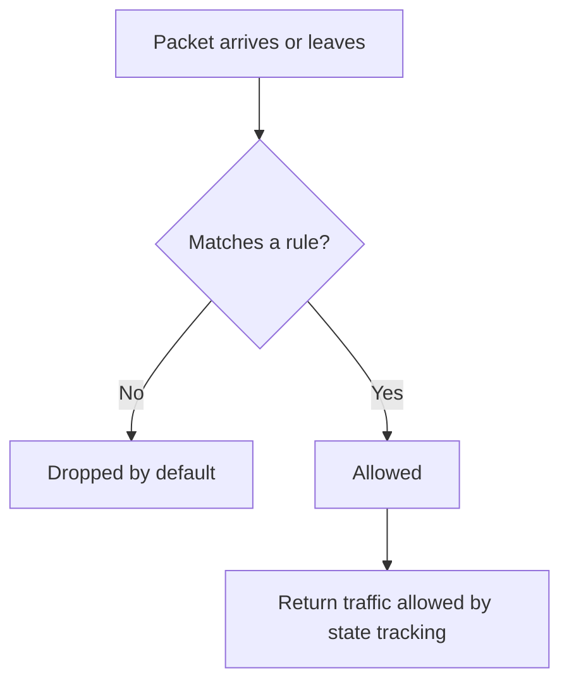
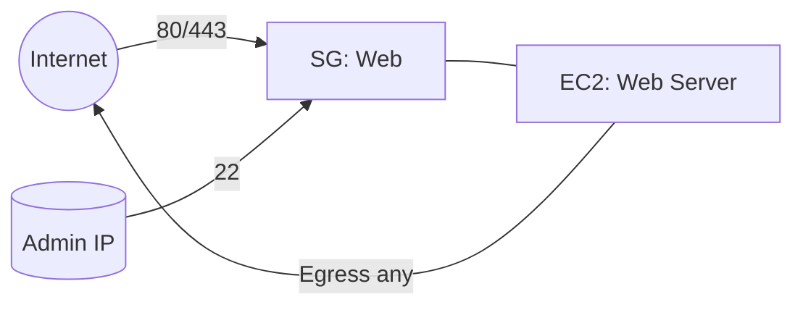
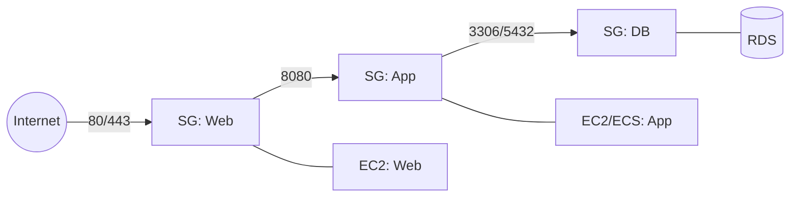
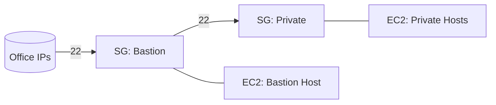
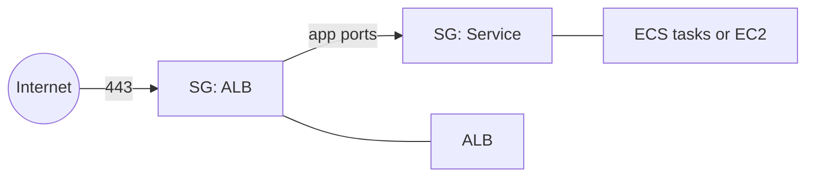
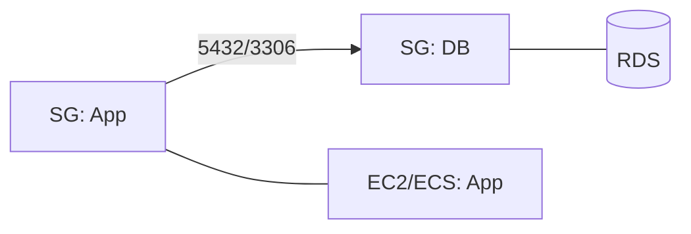

# AWS Security Groups Explanation

## 1. What Security Groups Are

Security Groups are stateful virtual firewalls attached to resources such as EC2, ALB or NLB, and RDS. They control inbound and outbound traffic with allow rules only. Responses to allowed traffic are automatically allowed back.

---

## 2. Core Concepts

- Inbound rules: what can reach the resource.
- Outbound rules: what the resource can reach.
- Protocol and port: TCP, UDP, ICMP and specific ports.
- Source or destination: a CIDR block or another Security Group in the same VPC, or in a peered VPC in the same Region.
- Multiple SGs on one resource: all allow rules are aggregated.

---

## 3. Evaluation Logic

- Default: deny everything.
- Allows only: there are no explicit deny rules.
- Stateful: replies to allowed flows are permitted without additional rules.

---

## 4. Simple Example: SSH and Web

Allow SSH for admins, public web for everyone, all egress for updates.

Inbound rules on SG: Web

- TCP 22 from 203.0.113.10/32
- TCP 80 from 0.0.0.0/0
- TCP 443 from 0.0.0.0/0

Outbound rules on SG: Web

- All traffic allowed

---

## 5. The “Middle SG” Pattern with SG Referencing

Security Groups can reference other SGs as the source or destination. This lets you gate traffic between groups of resources by membership, not IPs.

### 5.1 Three-tier app: Web → App → DB

- SG: Web inbound 80 and 443 from 0.0.0.0/0
- SG: App inbound 8080 from SG: Web
- SG: DB inbound DB port from SG: App

### 5.2 Bastion access

- SG: Bastion inbound 22 from office CIDRs
- SG: Private inbound 22 from SG: Bastion

### 5.3 Load balancer fronting services

- SG: ALB inbound 443 from 0.0.0.0/0
- SG: Service inbound app ports from SG: ALB

---

## 6. RDS with SG Referencing

Attach SG: App to your app instances and SG: DB to the database. On SG: DB, allow the DB port from SG: App. This grants DB access to all present and future app instances by SG membership rather than IP addresses.

---

## 7. Cross-VPC Notes

- You can reference a security group in a **peered VPC in the same Region** when the peering connection is active.
- For cross-Region peering, use CIDR rules rather than SG references.

---

## 8. Practical Hygiene

- Prefer targeted egress rules instead of allow all, where feasible.
- Avoid relying on the default SG. Create least-privilege SGs for each role or tier.
- Test flows with VPC Reachability Analyzer and verify health checks and target ports when using ALB or NLB.

---

## 9. Summary

- Security Groups are stateful, allow-only firewalls.
- SG-to-SG references let you build layered access based on membership.
- Use patterns like Web → App → DB, Bastion → Private, and ALB → Services for clean, scalable designs.
