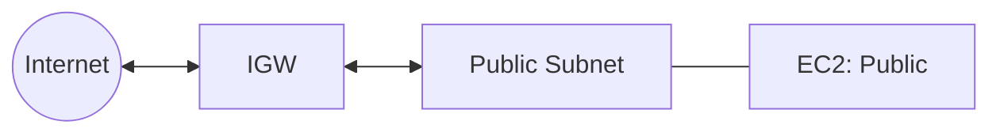
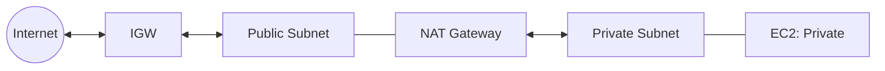
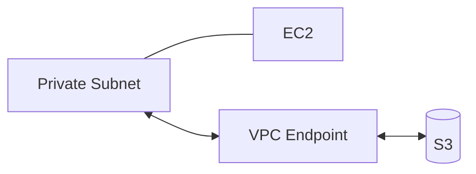

# AWS VPC Explanation

## 1. What a VPC Is

An Amazon Virtual Private Cloud (VPC) is a logically isolated section of the AWS cloud where you can launch resources in a defined network.  
You control IP ranges, subnets, route tables, gateways, and security boundaries.

---

## 2. Core Components

- **CIDR block**: Defines the IP address range of the VPC.
- **Subnets**: Segments of the VPC CIDR in specific Availability Zones.
  - **Public subnet**: Has a route to an Internet Gateway (IGW).
  - **Private subnet**: No direct route to the internet; can route outbound via NAT.
- **Route tables**: Define how traffic is routed (local VPC, IGW, NAT GW, VPC endpoints, VPN, Transit Gateway).
- **Gateways**:
  - **Internet Gateway (IGW)**: Two-way internet traffic for public subnets.
  - **NAT Gateway (NAT GW)**: Outbound-only internet access for private subnets.
  - **Egress-only Internet Gateway**: Outbound-only for IPv6.
  - **VPC Endpoints**: Private connections to AWS services without using the internet.
- **Security Groups and NACLs**: Stateful and stateless firewalls at the resource and subnet level.

---

## 3. Routing Patterns

### 3.1 Public Subnet with Internet Gateway

- Route table has `0.0.0.0/0` → IGW.
- Resources can send traffic to the internet and accept inbound traffic.
- Typical use: ALBs, bastion hosts, public web servers.

---

### 3.2 Private Subnet with NAT Gateway

- Route table has `0.0.0.0/0` → NAT GW.
- NAT GW sits in a **public subnet** with a route to IGW.
- Private resources get outbound internet but block inbound initiated traffic.

---

### 3.3 Private Subnet with VPC Endpoints

- Instead of NAT, private subnets route to **VPC endpoints** for AWS services.
- Gateway endpoints: S3, DynamoDB.
- Interface endpoints: most other services.
- Saves NAT data processing costs.

---

### 3.4 IPv6 with Egress-Only IGW

- Outbound IPv6 traffic possible without NAT.
- Inbound initiated traffic is blocked.

---

## 4. Why You Need an IGW with NAT GW

- A NAT GW must live in a **public subnet** (subnet with a default route to an IGW).
- NAT forwards traffic from private subnets to the IGW for the internet.
- Without an IGW, a NAT GW cannot send traffic out.

Think of it like:

- **IGW = the door to the internet.**
- **NAT GW = a one-way turnstile for private subnets to use that door.**

---

## 5. Cost Considerations

- **IGW**: No hourly cost.
- **NAT GW**: Hourly charge + per-GB data processing.
- **VPC Endpoints**: Gateway endpoints are free; interface endpoints have hourly + per-GB fees.
- Optimisation:
  - Use VPC endpoints for S3/DynamoDB to cut NAT costs.
  - Deploy NAT GW in each AZ to avoid cross-AZ charges.
  - Keep only resources that must be public in public subnets.

---

## 6. Summary

- A VPC gives you complete control over AWS networking.
- Public subnets need IGWs for two-way internet.
- Private subnets can use NAT GWs for outbound or VPC endpoints for private service access.
- A NAT GW always requires an IGW to reach the internet.
- For IPv6, use an egress-only IGW instead of NAT.

This layered model supports least privilege, scalability, and cost optimisation.
